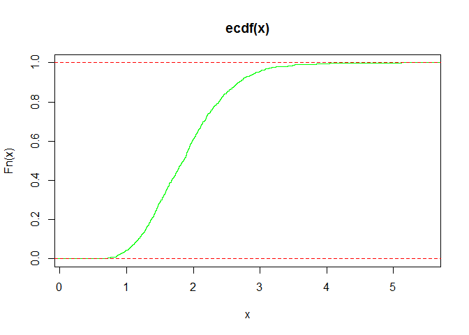
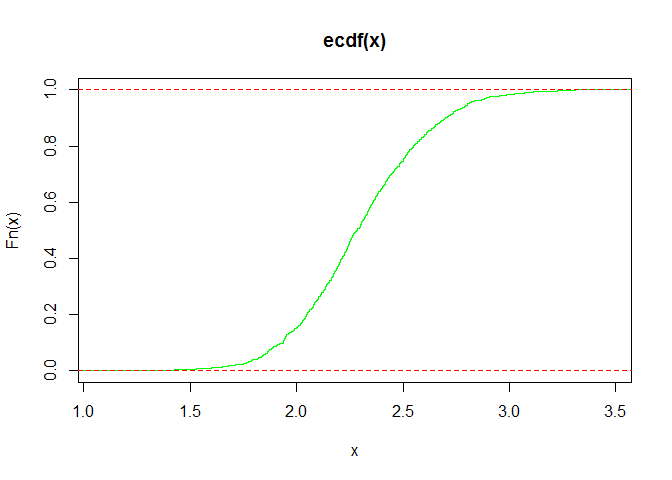
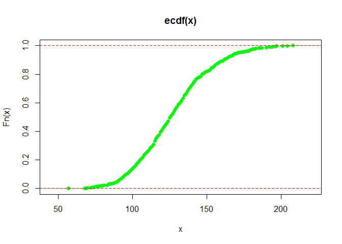
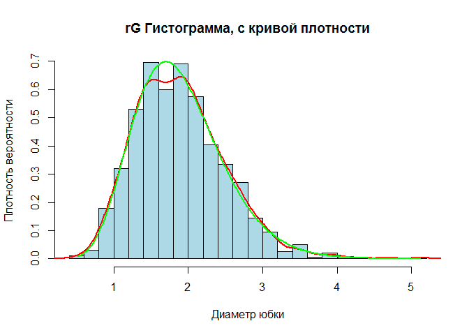
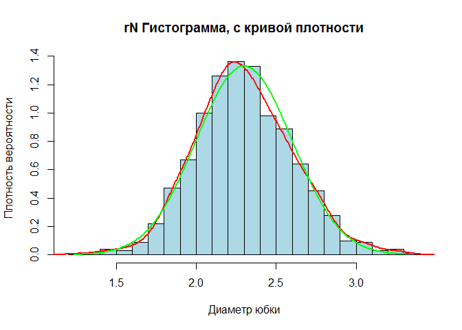
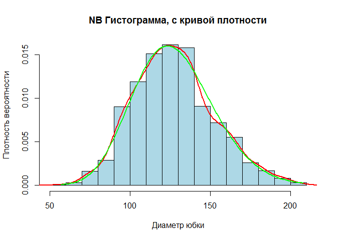
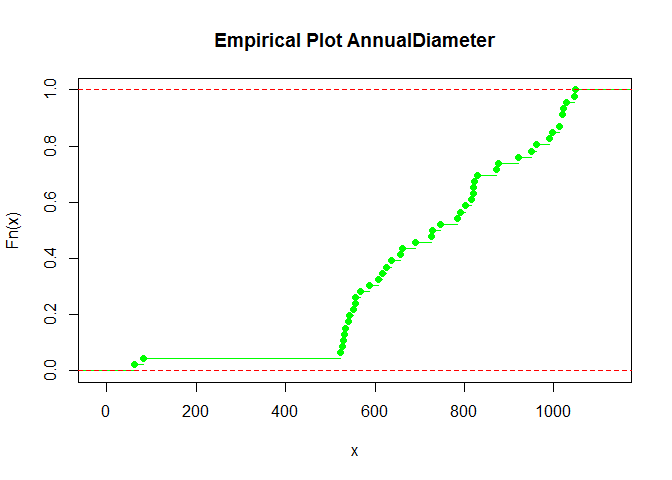
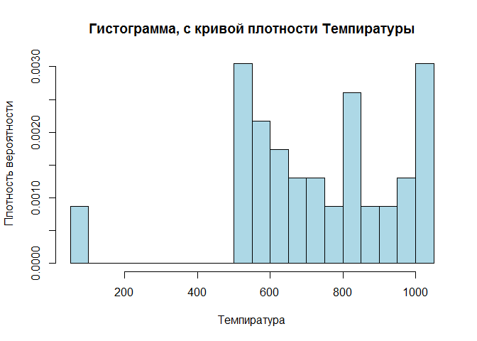

# IDZ 1
Nikita Fiodorov  
21.04.17  


<p align="right"><i>Из этой первой лекции по теории вероятностей я запомнил толь-</i></p>
<p align="right"><i>ко полузнакомый термин «математическое ожидание». Незнакомец</i></p>
<p align="right"><i>употреблял этот термин неоднократно, и каждый раз я представ-</i></p>
<p align="right"><i>лял себе большое помещение, вроде зала ожидания, с кафельным</i></p>
<p align="right"><i>полом, где сидят люди с портфелями и бюварами и, подбрасывая</i></p>
<p align="right"><i>время от времени к потолку монетки и бутерброды, сосредоточен-</i></p>
<p align="right"><i>но чего-то ожидают. До сих пор я часто вижу это во сне. Но тут</i></p>
<p align="right"><i>незнакомец оглушил меня звонким термином «предельная теорема</i></p>
<p align="right"><i>Муавра — Лапласа» и сказал, что всё это к делу не относится.</i></p>
<p align="right">Аркадий и Борис Стругацкие, Стажёры</p>


---


<a name="Idz_1"></a>

[- -> Код {file}](https://github.com/NikitaIT/org.stepik.math.statistics/blob/master/IDZ_1/IDZ.R)

[- -> Данные {file}](https://github.com/NikitaIT/org.stepik.math.statistics/blob/master/IDZ_1/AnnualDiameterProp.csv)

[- -> Задание {file}](https://github.com/NikitaIT/org.stepik.math.statistics/blob/master/IDZ_1/%D0%97%D0%B0%D0%B4%D0%B0%D0%BD%D0%B8%D0%B5%20%D0%BE%D1%82%209.2.2017.docx)

### Данные

Даны следующие распределения и параметры:

Тип Распределения			      | Параметры
----------------------------|--------------
Гамма						            | p=10, b=5.3
Нормальное					        | a=2.3, σ=0.3
Отрицательное Биномиальное 	| m=32, p=1/5


Распределение в файле: [file](https://github.com/NikitaIT/org.stepik.math.statistics/blob/master/IDZ_1/AnnualDiameterProp.csv)

### Выполнение работы


Необходимо для каждого распределения:

**a.	сгенерировать выборку длины 1000 из данного распределения (см. стр. 19 методички)**


```
##            rG   rN rNB
## Min.    0.509 1.24  57
## 1st Qu. 1.450 2.09 110
## Median  1.850 2.28 126
## Mean    1.890 2.30 128
## 3rd Qu. 2.260 2.50 142
## Max.    5.130 3.31 208
```

**b.	построить по данной выборке эмпирическую функцию распределения;**

Эмпирическая функция распределения в каждой точке принимает значение отношения числа наблюдений меньше этой точки к общему числу наблюдений.
$$\hat{F}_m(x)\;=\;\frac{1}{m}\sum_{i=1}^m I_{\left\{x_i\leq x\right\}}.$$

<h2 align="center">Эмпирические для rG, rN, rNB</h2>

<!-- --><!-- --><!-- -->


<p align="right"><b>Выводы:</b></p>
<p align="right">Эмпирическую функцию можно рассматривать как состоятельную оценку теоретической функции распределения </p><p align="right">т.к. по усиленному закону больших чисел $\hat{F}_m(x)$ сходится почти наверное к теоретической функции распределения $F(x):\hat{F}_m(x)\to F(x)$ почти наверное при $m \rightarrow \infty$.</p>
----

**c.	построить гистограмму частот;**
**d.	сравнить гистограмму частот и реальную плотность данного распределения (вычисление значения плотности в точке в пакете R описано на той же 19 стр.)**

Пусть $X_{1},\ldots ,X_{n},\ldots$  — выборка из некоторого распределения. Определим разбиение числовой прямой ${\displaystyle -\infty <a_{0}<a_{1}<\cdots <a_{k-1}<a_{k}<\infty }$. Пусть ${\displaystyle n_{i}=\sum \limits _{j=1}^{n}\mathbf {1} _{\{X_{j}\in (a_{i-1},a_{i}]\}},\;\quad i=1,\ldots ,k}$
— число элементов выборки, попавших в ${\displaystyle i}$-й интервал. Тогда кусочно-постоянная функция ${\displaystyle {\tilde {h}}:\mathbb {R} \to \mathbb {R} }$, имеющая вид:

${\displaystyle {\tilde {h}}(x)={\frac {n_{i}}{n\Delta a_{i}}},\Delta a_{i}=a_{i}-a_{i-1},\;i=1,\ldots ,k\;}$, — называется нормализованной гистограммой.


<p color="green" align="right">**Реальное** распределение - **ЗЕЛЕНЫМ**</p>
<p color="red" align="right">**Выборочное** распределение - **КРАСНЫМ**</p>

<h2 align="center">Гистограммы</h2>

<!-- --><!-- --><!-- -->


<p align="right"><b>Выводы:</b></p>
<p align="right"><i>По гистограммам видно, что распр. выборки из 1000 наблюбений близко к ген.сов. и видно распределение плотности</i></p>
----


**e.	вычислить следующие выборочные характеристики:  выборочное среднее, выборочную дисперсию, выборочную асимметрию, выборочный эксцесс; (см. стр. 20-22 методички)**

Таблица выборочных значений:


```
##     mean var    asm   exc    
## rG  1.89 0.367  0.761 1.29   
## rN  2.3  0.0926 0.164 0.242  
## rNB 128  626    0.342 -0.0371
```

**f.	сравнить результаты пункта e  с реальными характеристиками распределения** 

$$\Gamma (k,\theta ), {\displaystyle \mathrm {Gamma} (k,\theta )}$$
Плотность вероятности	$\displaystyle x^{{k-1}}{\frac  {e^{{-{\frac  {x}{\theta }}}}}{\Gamma (k)\theta ^{k}}}$

Функция распределения	 ${\displaystyle {\frac {\gamma (x/\theta ,k)}{\Gamma (k)}}}$

Математическое ожидание	${\displaystyle k\theta }$

Дисперсия	${\displaystyle k\theta ^{2}}$

Коэффициент асимметрии	${\displaystyle \frac  {2}{{\sqrt  {k}}}}$

Коэффициент эксцесса	${\displaystyle \frac  {6}{k}}$

$${\displaystyle \mathrm {NB} (r,p)}$$
Параметры	$r>0$ , ${\displaystyle p\in (0;1)}$ , $q\equiv 1-p$

Носитель	$k\in \{0,1,2,\ldots \}$

Функция вероятности	${\displaystyle {\frac {\Gamma (r+k)}{k!\,\Gamma (r)}}\,p^{r}\,q^{k}}$

Функция распределения	${\displaystyle I_{p}(r,k+1)}$

Математическое ожидание	${\displaystyle {\frac {rq}{p}}}$

Дисперсия	${\displaystyle {\frac {rq}{p^{2}}}}$

Коэффициент асимметрии	${\displaystyle {\frac {2-p}{\sqrt {r\,q}}}}$

Коэффициент эксцесса	${\displaystyle {\frac {6}{r}}+{\frac {p^{2}}{r\,q}}}$

$${\displaystyle N\left(\mu ,\sigma ^{2}\right)}$$
Параметры	$\mu$ — коэффициент сдвига (вещественное число), $\sigma > 0$ — коэффициент масштаба (вещественный, строго положительный)

Носитель	${\displaystyle x\in \left(-\infty ;+\infty \right)}$

Плотность вероятности	${\displaystyle {\frac {1}{\sigma {\sqrt {2\pi }}}}\;\exp \left(-{\frac {\left(x-\mu \right)^{2}}{2\sigma ^{2}}}\right)}$

Функция распределения	${\frac {1}{2}}\left[1+\operatorname {erf} \left({\frac {x-\mu }{\sqrt {2\sigma ^{2}}}}\right)\right]$

Математическое ожидание	$\mu$

Дисперсия	$\sigma ^{2}$

Коэффициент асимметрии	$0$

Коэффициент эксцесса	$0$

Таблица ожидаемых значений:


```
##       mean     var   asm  exc
## rG    1.89   0.356 0.632 0.60
## rN    2.30   0.090 0.000 0.00
## rNB 128.00 640.000 0.356 0.18
```

Таблица смежности:


```
##          mean       var     asm    exc
## rG   0.006543   0.01056  0.1284  0.689
## rN  -0.000415   0.00264  0.1644  0.242
## rNB -0.462000 -14.21766 -0.0142 -0.217
```
<p align="right"><b>Выводы:</b></p>
<p align="right"><i>Значения выборки совпали с значегиями для ГС, предположительно различия не значимы</i></p></p>
----
###Распределение из файла:


**Повторяем пункты a-d**

<h2 align="center">Эмпирическое распределение</h2>
<!-- -->

<h2 align="center">Гистограмма</h2>

<!-- -->

Таблица значений параметров:


```
##   mean   var    asm   exc
## 1  731 51786 -0.735 0.773
```

<p align="right"><b>Выводы:</b></p>
<p align="right"><i>Данных(46 наблюдений) недостаточно, чтобы делать выводы о распределении темпиратур, имеются выбросы, возможно это ошибочные данные и есть смысл исключить их или заменить на среднее по выборке. Эмпирическая функция похожа на распределение Вейбулла</i></p>

----
```R

# сохраняем результаты

write.csv(AnnualDiameterProp,file = "AnnualDiameterProp.csv")

write.csv(distributionsProp,file = "tProp.csv")

```


