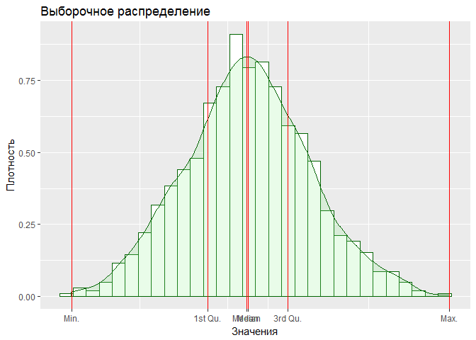
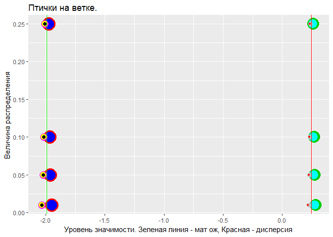

# IDZ_3
Nikita  
23.03.17  


# Построение доверительных интервалов.


##Доверительные интервалы для параметров нормального распределения. 

Постройте выборку длины 1000 из нормального распределения N (μ = -2,σ = 0.25) (параметры выбираете самостоятельно) Для различных уровней значимости (a = 0.25, a = 0.1, a = 0.05, a = 0.01)


$$f(x)={\tfrac {1}{\sigma {\sqrt {2\pi }}}}\;e^{-{\frac {(x-\mu )^{2}}{2\sigma ^{2}}}}$$

```
##    Min. 1st Qu.  Median    Mean 3rd Qu.    Max. 
##   -3.40   -2.31   -2.00   -1.99   -1.67   -0.38
```

<!-- -->

####Определение

Доверительный интервал($interval$) - Интервал, построенный с помощью случайной выборки из распределения с неизвестным параметром, такой, что он содержит данный параметр с заданной вероятностью.

Если многократно повторять эксперимент, для каждой выборки рассчитывать свой доверительный интервал, то в $p$ случаев истинное среднее будет находиться внутри доверительного интервала.

т.е. с $(1-a)*100%$ вероятностью мы уверены, что интервал $\mu \pm interval$ у выборки включает среднее ГС.

Значения квантилей:

```
##      qnorm   qt
## 0.25  1.15 1.15
## 0.1   1.64 1.65
## 0.05  1.96 1.96
## 0.01  2.58 2.58
```
Чем меньше уровень значимости, тем шире интервал.

###a.	Считая  дисперсию известной,  постройте доверительный интервал для мат. ожидания.

Пусть  $X_{1},\ldots ,X_{n}\sim \mathrm {N} (\mu ,\sigma ^{2})$  — независимая выборка из нормального распределения, где $\sigma ^{2}$ — известная дисперсия. Определим произвольное $\alpha \in [0,1]$ и построим доверительный интервал для неизвестного среднего $\mu$ .

**Утверждение.** Случайная величина $Z={\frac {{\bar {X}}-\mu }{\sigma /{\sqrt {n}}}}$
имеет стандартное нормальное распределение $N (0,1)$. Пусть $z_{\alpha }$ — $\alpha$ -квантиль стандартного нормального распределения. Тогда в силу симметрии последнего имеем:

$$\mathbb {P} \left(-z_{1-{\frac {\alpha }{2}}}\leq Z\leq z_{1-{\frac {\alpha }{2}}}\right)=1-\alpha$$

После подстановки выражения для $Z$ и несложных алгебраических преобразований получаем:


$$ \mathbb {P} \left({\bar {X}}-z_{1-{\frac {\alpha }{2}}}{\frac {\sigma }{\sqrt {n}}}\leq \mu \leq {\bar {X}}+z_{1-{\frac {\alpha }{2}}}{\frac {\sigma }{\sqrt {n}}}\right)=1-\alpha$$
Интервалы:


```
##       Left Right
## 0.25 -2.01 -1.97
## 0.1  -2.02 -1.97
## 0.05 -2.02 -1.96
## 0.01 -2.03 -1.95
```


###b.	Считая  дисперсию неизвестной,  постройте доверительный интервал для мат. ожидания.

Пусть $X_{1},\ldots ,X_{n}\sim \mathrm {N} (\mu ,\sigma ^{2})$ — независимая выборка из нормального распределения, где $\mu ,\sigma ^{2}$ — неизвестные константы. Построим доверительный интервал для неизвестного среднего $\mu$ .

**Утверждение.** Случайная величина $T={\frac {{\bar {X}}-\mu }{S/{\sqrt {n}}}},$ где  $S$ — несмещённое выборочное стандартное отклонение, имеет распределение Стьюдента с $n-1$ степенями свободы $t(n-1)$. Пусть ${\displaystyle t_{\alpha ,n-1}}$ -  ${\displaystyle \alpha }$ квантили распределения Стьюдента. Тогда в силу симметрии последнего имеем:

$$\mathbb {P} \left(-t_{1-{\frac {\alpha }{2}},n-1}\leq T\leq t_{1-{\frac {\alpha }{2}},n-1}\right)=1-\alpha $$
После подстановки выражения для $T$ и несложных алгебраических преобразований получаем:

$$\mathbb {P} \left({\bar {X}}-t_{1-{\frac {\alpha }{2}},n-1}{\frac {S}{\sqrt {n}}}\leq \mu \leq {\bar {X}}+t_{1-{\frac {\alpha }{2}},n-1}{\frac {S}{\sqrt {n}}}\right)=1-\alpha$$
Интервалы:


```
##       Left Right
## 0.25 -2.01 -1.97
## 0.1  -2.02 -1.97
## 0.05 -2.02 -1.96
## 0.01 -2.03 -1.95
```

###c.  Постройте доверительный интервал для дисперсии.

Пусть $X_{1},\ldots ,X_{n}\sim {\mathcal {N}}(\mu ,\sigma ^{2})$ — независимая выборка из нормального распределения, где $\mu$ , $\sigma ^{2}$ — неизвестные константы. Построим доверительный интервал для неизвестной дисперсии $\sigma ^{2}$.

Теорема Фишера для нормальных выборок. Случайная величина

$$H={\frac {(n-1)S^{2}}{\sigma ^{2}}},$$
где $S^{2}$ — несмещённая выборочная дисперсия, имеет распределение $\chi ^{2}(n-1)$. Тогда имеем:

$$ \mathbb {P} \left(\chi _{{\frac {1-\alpha }{2}},n-1}^{2}\leqslant H\leqslant \chi _{{\frac {1+\alpha }{2}},n-1}^{2}\right)=\alpha$$

После подстановки выражения для $H$ и несложных алгебраических преобразований получаем:

$$ \mathbb {P} \left({\frac {(n-1)S^{2}}{\chi _{{\frac {1+\alpha }{2}},n-1}^{2}}}\leqslant \sigma ^{2}\leqslant {\frac {(n-1)S^{2}}{\chi _{{\frac {1-\alpha }{2}},n-1}^{2}}}\right)=\alpha$$


```
##       Left Right
## 0.25 0.238 0.264
## 0.1  0.233 0.270
## 0.05 0.230 0.274
## 0.01 0.224 0.282
```
###d.	Считая  дисперсию s известной,  постройте асимптотический  доверительный интервал для a на базе ОМП. Сравните с результатом пункта a).
Если эксперимент регулярный, то ОМП $\bar θ_n$ параметра $θ$ является

асимптотически нормальной и состоятельной, то есть $\sqrt{I(θ)}(\bar θ_n − θ)⇒ N(0,1)$, где $I(θ)$ — информация Фишера для параметра $θ$ по наблюдениям $X$.

Можно выбрать квантили $x_α$, решая уравнение $Ф(x_α) = 1- \frac {α}{2}$, где $Ф$ — функция распределения стандартного нормального закона.

В этом случае, в общем виде для параметра $θ$ доверительный интервал уровня $1-α$ будет выглядеть так:

$$[ θ_n − I( θ_n)^{−1 /2} x_{\alpha} , θ_n + I( θ_n)^{−1 /2} x_{\alpha}]$$
Информация Фишера обладает свойством: если имеется выборка из $n$

элементов, где $I_i(θ)$ — информация Фишера для одного $i$-го элемента выборки,

то $I(θ)=nI_i(θ)$.$I(a) = σ^{−2}$ На основании этого свойства и вида доверительного интервала

построим асимптотический доверительный интервал для среднего:
$$[X−\frac {(sx_α)}{\sqrt n}, X+\frac {(sx_α)}{\sqrt n} ]$$


```
##       Left Right
## 0.25 -2.01 -1.97
## 0.1  -2.02 -1.97
## 0.05 -2.02 -1.96
## 0.01 -2.03 -1.95
```

###e.	Считая  мат. ожид. а известным,  постройте асимптотический  доверительный интервал для s на базе ОМП. Сравните с результатом пункта c).

Если эксперимент регулярный, то ОМП $\bar θ_n$ параметра $θ$ является

асимптотически нормальной и состоятельной, то есть $\sqrt{I(θ)}(\bar θ_n − θ)⇒ N(0,1)$, где $I(θ)$ — информация Фишера для параметра $θ$ по наблюдениям $X$.

Можно выбрать квантили $x_α$, решая уравнение $Ф(x_α) = 1- \frac {α}{2}$, где $Ф$ — функция распределения стандартного нормального закона.

В этом случае, в общем виде для параметра $θ$ доверительный интервал уровня $1-α$ будет выглядеть так:

$$[ θ_n − I( θ_n)^{−1 /2} x_{\alpha} , θ_n + I( θ_n)^{−1 /2} x_{\alpha}]$$
Информация Фишера обладает свойством: если имеется выборка из $n$

элементов, где $I_i(θ)$ — информация Фишера для одного $i$-го элемента выборки,

то $I(θ)=nI_i(θ)$.$I(σ^2) = σ^{−4/2}$ На основании этого свойства и вида доверительного интервала

построим асимптотический доверительный интервал для дисперсии:

 $$[s^2−\sqrt \frac {2}{n} s^2 x_\alpha, s^2+\sqrt \frac {2}{n} s^2 x_\alpha]$$


```
##       Left Right
## 0.25 0.233 0.259
## 0.1  0.228 0.264
## 0.05 0.224 0.267
## 0.01 0.218 0.274
```

###  Сравнение E c C

```
##      E.minus.C
## 0.25   0.00474
## 0.1    0.00507
## 0.05   0.00536
## 0.01   0.00609
```
Как видим значимых отличий нет.

###  Сравнение D c A

```
##      D.minus.A
## 0.25         0
## 0.1          0
## 0.05         0
## 0.01         0
```
Как видим значимых отличий нет.

То же видим на графике
<!-- -->

##  Асимптотические  доверительные интервалы на базе ОМП

На основании оценок, полученных в предыдущем ДЗ (задания 2 и 3), постройте асимптотические доверительные интервалы уровней значимости(a = 0.25, a = 0.1, a = 0.05, a = 0.01).

Я еще не доделал то идз, чтобы сделать эту часть))
