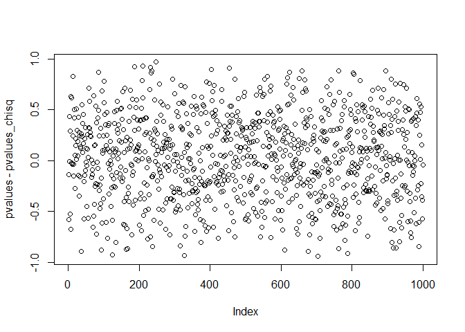

# IDZ_5
Nikita  
22.04.17  


1)Критерий Колмогорова проверки простой гипотезы согласия.


Выбираете любые три абсолютно непрерывных распределения из списка ниже. Необходимо, чтобы из них: хотя бы одно имело ограниченный носитель, хотя бы одно --- неограниченный (например, бета, нормальное, Коши) Без поголовного списывания, проявите фантазию.  Для этих семейств выбираете параметры θ_0. Генерируете выборки из них объема 1000.


```
##    [1] 5.33 5.74 4.85 5.35 4.91 4.14 3.43 4.91 5.12 5.30 5.50 5.21 5.70
##   [14] 5.14 5.69 4.69 4.33 3.43 3.63 5.42 6.33 5.63 6.57 4.36 6.28 5.44
##   [27] 7.22 3.90 4.65 5.92 3.83 5.14 5.56 5.62 5.10 3.34 5.37 4.64 3.20
##   [40] 5.81 5.42 4.51 5.38 4.74 6.41 5.61 4.25 6.17 5.15 7.73 4.17 2.64
##   [53] 5.01 5.16 5.32 6.10 5.04 5.15 6.42 5.84 4.01 4.36 4.63 3.88 3.91
##   [66] 4.75 4.68 4.61 4.51 5.67 4.36 4.78 6.20 4.39 5.14 5.49 6.99 5.32
##   [79] 6.13 6.29 4.60 3.13 3.89 4.02 4.63 6.98 5.31 6.80 4.98 5.18 3.56
##   [92] 5.57 4.55 3.96 4.69 4.15 6.25 4.95 5.10 5.56 5.15 6.01 4.86 5.43
##  [105] 3.99 2.86 4.87 7.08 4.23 4.65 6.05 6.75 5.99 6.17 4.51 3.15 6.31
##  [118] 6.01 4.30 3.16 4.08 5.03 5.08 5.57 6.58 3.59 6.54 3.80 5.90 3.93
##  [131] 4.13 4.25 6.03 4.30 5.98 4.88 6.17 5.79 6.00 4.86 3.95 4.04 5.06
##  [144] 6.26 4.54 5.48 4.83 5.04 3.43 3.76 2.88 4.44 5.32 3.88 5.38 4.39
##  [157] 5.25 6.23 5.16 3.51 5.91 4.71 3.92 6.72 5.03 4.61 4.67 4.18 6.76
##  [170] 5.52 5.05 2.82 6.59 6.50 4.61 4.35 6.05 6.09 3.55 5.89 5.53 5.24
##  [183] 3.63 4.87 5.50 3.00 4.81 4.40 5.37 5.88 3.97 5.21 6.88 6.04 6.22
##  [196] 5.32 5.69 5.14 4.11 5.21 5.02 4.28 5.45 3.45 3.39 5.49 6.15 5.08
##  [209] 4.33 5.64 5.27 4.62 5.79 3.55 4.40 3.97 7.50 5.20 6.04 6.23 4.09
##  [222] 3.27 4.81 5.35 4.87 5.71 6.90 4.98 5.05 3.64 5.23 4.02 6.95 3.81
##  [235] 2.95 5.53 3.87 6.98 5.35 3.75 4.03 3.94 5.83 5.03 7.36 5.63 6.48
##  [248] 5.74 4.88 5.83 4.97 3.92 6.01 5.06 6.43 5.62 5.03 6.17 4.74 5.05
##  [261] 2.97 5.98 6.15 4.25 5.07 4.89 6.86 4.53 6.71 7.10 4.10 5.78 4.48
##  [274] 5.48 4.50 4.70 3.98 5.54 4.45 5.87 7.59 5.52 5.90 7.13 6.53 4.83
##  [287] 5.03 5.34 5.26 4.00 5.49 5.21 7.13 4.28 4.28 6.49 7.41 4.92 4.63
##  [300] 4.52 4.11 7.41 6.93 6.04 4.51 5.18 5.04 3.68 5.07 4.60 4.93 7.94
##  [313] 3.20 4.41 6.20 5.28 6.34 4.39 5.52 4.56 2.21 6.44 5.04 5.82 4.69
##  [326] 7.26 6.13 5.21 3.95 5.54 5.99 5.24 4.08 4.01 5.40 6.07 6.97 3.84
##  [339] 5.13 3.53 5.78 4.46 5.63 5.95 5.62 4.70 3.79 4.20 5.02 5.55 5.52
##  [352] 5.26 7.21 6.55 4.42 4.07 5.17 5.08 2.56 3.08 3.95 4.94 6.15 3.34
##  [365] 4.51 5.09 5.01 4.55 3.63 6.14 3.97 4.82 4.94 5.36 8.12 5.75 5.34
##  [378] 4.45 4.41 5.00 6.35 5.19 6.40 5.39 4.21 4.92 5.45 5.42 5.43 5.36
##  [391] 6.14 3.22 4.27 4.66 4.64 5.97 4.02 5.17 5.14 5.40 6.41 4.80 6.41
##  [404] 4.48 4.73 5.59 6.67 3.67 5.93 6.79 4.81 5.31 5.31 4.87 5.41 5.82
##  [417] 5.00 5.91 3.95 4.32 5.32 4.75 5.90 4.63 5.91 3.86 4.28 5.34 4.73
##  [430] 4.53 4.88 3.38 5.34 3.80 6.84 5.24 4.70 4.83 6.20 5.52 4.97 3.46
##  [443] 6.26 4.74 3.63 4.76 5.74 6.45 5.37 3.97 5.39 5.45 5.40 5.06 3.59
##  [456] 4.48 3.50 4.17 3.97 5.95 6.43 4.39 6.85 3.32 4.88 5.96 5.26 5.79
##  [469] 5.22 6.03 4.40 4.64 5.62 5.03 2.41 3.85 5.29 4.77 5.15 3.84 4.25
##  [482] 5.90 5.30 4.26 3.80 5.81 5.71 5.86 5.29 4.07 4.38 6.35 3.24 5.17
##  [495] 2.77 5.81 5.51 6.50 4.15 4.88 4.60 5.05 5.98 4.91 4.70 3.84 3.99
##  [508] 3.49 3.14 5.67 5.75 4.38 6.52 6.77 4.12 5.92 4.37 4.27 3.66 5.28
##  [521] 2.87 5.14 2.69 3.78 5.62 7.12 3.54 5.24 6.43 3.82 3.28 6.60 5.71
##  [534] 4.29 4.82 5.32 5.21 6.44 3.79 5.08 5.26 4.30 5.26 5.50 3.58 4.43
##  [547] 5.36 4.39 4.19 5.24 5.50 3.44 5.85 4.60 4.47 3.65 6.26 5.54 4.02
##  [560] 6.17 6.26 6.31 6.44 5.79 5.32 6.95 4.50 6.26 5.97 6.41 5.55 6.25
##  [573] 5.83 3.85 4.45 2.27 5.52 8.45 5.61 2.91 4.17 4.21 5.73 4.82 3.88
##  [586] 5.36 4.89 4.25 4.69 5.90 5.01 6.15 4.73 5.00 6.61 4.95 5.38 4.79
##  [599] 4.54 5.95 5.39 4.49 4.70 5.77 4.21 5.68 3.69 5.50 3.83 4.77 5.88
##  [612] 6.06 4.35 4.92 3.26 5.03 5.57 2.84 3.90 4.51 3.15 5.78 4.53 5.95
##  [625] 4.26 5.37 5.07 5.19 7.30 5.93 3.20 5.22 4.02 7.36 4.19 5.53 4.92
##  [638] 4.84 4.91 5.35 5.36 4.79 6.00 5.63 5.62 5.09 6.24 6.36 4.73 3.88
##  [651] 5.47 4.48 5.49 2.58 5.95 5.51 4.61 3.06 3.52 5.73 4.54 4.25 5.00
##  [664] 5.95 3.88 4.51 4.50 6.43 7.00 5.41 6.08 5.02 4.67 5.05 3.80 4.51
##  [677] 5.41 6.31 4.05 4.15 5.05 4.33 4.47 4.76 4.86 4.66 6.11 4.62 4.71
##  [690] 4.83 4.84 6.01 5.21 4.04 6.38 5.78 4.48 4.89 7.14 5.43 6.99 3.86
##  [703] 3.86 6.56 4.71 4.98 5.61 5.18 7.41 4.68 6.65 3.44 4.64 5.00 4.29
##  [716] 4.90 6.31 3.55 5.61 6.53 5.37 5.25 4.60 7.28 7.30 5.36 4.87 5.09
##  [729] 4.68 5.36 4.87 5.81 5.01 7.26 5.07 5.55 3.93 7.67 5.54 5.21 4.50
##  [742] 5.47 3.82 3.77 5.76 4.57 3.56 4.90 3.44 3.67 5.27 4.79 5.81 4.72
##  [755] 2.76 6.45 6.01 4.83 5.39 4.29 5.71 6.78 5.18 4.94 4.48 6.11 3.11
##  [768] 4.63 4.26 3.70 6.01 6.78 5.50 5.54 4.78 3.95 4.15 6.45 6.03 5.18
##  [781] 5.13 5.09 4.96 3.84 5.11 5.82 4.52 4.85 5.38 5.87 6.06 4.11 4.51
##  [794] 3.74 4.99 4.79 6.09 6.31 4.04 3.37 4.21 4.53 5.52 4.39 6.42 4.96
##  [807] 5.78 7.33 3.25 4.07 4.85 5.03 2.92 5.51 5.74 4.21 4.23 5.86 4.80
##  [820] 4.81 5.97 4.47 7.83 3.88 4.56 4.37 5.57 4.59 4.44 5.16 5.56 5.46
##  [833] 6.95 5.03 3.51 3.99 5.24 6.99 3.38 5.53 4.86 5.39 4.27 4.98 4.25
##  [846] 3.95 4.80 6.01 4.29 4.51 4.50 5.33 5.23 5.15 4.51 5.85 6.23 3.23
##  [859] 5.69 4.91 6.54 5.04 5.66 5.82 4.39 5.51 4.87 4.61 3.64 6.30 4.88
##  [872] 5.18 4.55 5.38 5.54 4.65 3.67 5.14 4.53 4.47 4.54 4.42 3.79 7.50
##  [885] 4.80 4.53 4.80 4.64 4.43 4.90 5.58 4.26 4.58 4.61 4.27 6.48 5.47
##  [898] 6.73 7.25 5.23 5.52 4.68 5.09 4.12 7.27 5.72 4.23 4.09 4.73 5.09
##  [911] 4.60 5.80 4.59 3.74 5.30 4.69 5.97 6.26 4.44 5.81 6.57 5.45 6.77
##  [924] 4.64 4.13 4.58 4.41 4.77 3.21 4.73 4.35 3.51 4.87 2.79 4.21 3.57
##  [937] 4.80 3.92 3.46 5.16 5.15 6.01 4.26 6.29 5.77 4.09 3.20 5.42 5.67
##  [950] 4.78 6.19 5.40 5.28 6.47 5.23 3.85 3.66 3.22 6.27 3.49 3.08 6.34
##  [963] 6.03 4.95 5.43 7.10 4.93 6.50 4.54 3.48 4.99 3.64 4.87 5.28 7.32
##  [976] 5.13 3.68 5.46 4.94 5.87 6.84 4.62 4.52 4.32 5.87 6.19 4.79 4.36
##  [989] 3.97 5.14 5.24 4.90 4.33 3.53 5.30 4.01 5.98 3.65 4.87 5.16
```

```
##    [1] 2.21 2.27 2.41 2.56 2.58 2.64 2.69 2.76 2.77 2.79 2.82 2.84 2.86
##   [14] 2.87 2.88 2.91 2.92 2.95 2.97 3.00 3.06 3.08 3.08 3.11 3.13 3.14
##   [27] 3.15 3.15 3.16 3.20 3.20 3.20 3.20 3.21 3.22 3.22 3.23 3.24 3.25
##   [40] 3.26 3.27 3.28 3.32 3.34 3.34 3.37 3.38 3.38 3.39 3.43 3.43 3.43
##   [53] 3.44 3.44 3.44 3.45 3.46 3.46 3.48 3.49 3.49 3.50 3.51 3.51 3.51
##   [66] 3.52 3.53 3.53 3.54 3.55 3.55 3.55 3.56 3.56 3.57 3.58 3.59 3.59
##   [79] 3.63 3.63 3.63 3.63 3.64 3.64 3.64 3.65 3.65 3.66 3.66 3.67 3.67
##   [92] 3.67 3.68 3.68 3.69 3.70 3.74 3.74 3.75 3.76 3.77 3.78 3.79 3.79
##  [105] 3.79 3.80 3.80 3.80 3.80 3.81 3.82 3.82 3.83 3.83 3.84 3.84 3.84
##  [118] 3.84 3.85 3.85 3.85 3.86 3.86 3.86 3.87 3.88 3.88 3.88 3.88 3.88
##  [131] 3.88 3.89 3.90 3.90 3.91 3.92 3.92 3.92 3.93 3.93 3.94 3.95 3.95
##  [144] 3.95 3.95 3.95 3.95 3.96 3.97 3.97 3.97 3.97 3.97 3.97 3.98 3.99
##  [157] 3.99 3.99 4.00 4.01 4.01 4.01 4.02 4.02 4.02 4.02 4.02 4.03 4.04
##  [170] 4.04 4.04 4.05 4.07 4.07 4.07 4.08 4.08 4.09 4.09 4.09 4.10 4.11
##  [183] 4.11 4.11 4.12 4.12 4.13 4.13 4.14 4.15 4.15 4.15 4.15 4.17 4.17
##  [196] 4.17 4.18 4.19 4.19 4.20 4.21 4.21 4.21 4.21 4.21 4.21 4.23 4.23
##  [209] 4.23 4.25 4.25 4.25 4.25 4.25 4.25 4.25 4.26 4.26 4.26 4.26 4.26
##  [222] 4.27 4.27 4.27 4.27 4.28 4.28 4.28 4.28 4.29 4.29 4.29 4.29 4.30
##  [235] 4.30 4.30 4.32 4.32 4.33 4.33 4.33 4.33 4.35 4.35 4.35 4.36 4.36
##  [248] 4.36 4.36 4.37 4.37 4.38 4.38 4.39 4.39 4.39 4.39 4.39 4.39 4.39
##  [261] 4.40 4.40 4.40 4.41 4.41 4.41 4.42 4.42 4.43 4.43 4.44 4.44 4.44
##  [274] 4.45 4.45 4.45 4.46 4.47 4.47 4.47 4.47 4.48 4.48 4.48 4.48 4.48
##  [287] 4.48 4.49 4.50 4.50 4.50 4.50 4.50 4.51 4.51 4.51 4.51 4.51 4.51
##  [300] 4.51 4.51 4.51 4.51 4.51 4.52 4.52 4.52 4.53 4.53 4.53 4.53 4.53
##  [313] 4.53 4.54 4.54 4.54 4.54 4.54 4.55 4.55 4.55 4.56 4.56 4.57 4.58
##  [326] 4.58 4.59 4.59 4.60 4.60 4.60 4.60 4.60 4.60 4.61 4.61 4.61 4.61
##  [339] 4.61 4.61 4.62 4.62 4.62 4.63 4.63 4.63 4.63 4.63 4.64 4.64 4.64
##  [352] 4.64 4.64 4.64 4.65 4.65 4.65 4.66 4.66 4.67 4.67 4.68 4.68 4.68
##  [365] 4.68 4.69 4.69 4.69 4.69 4.69 4.70 4.70 4.70 4.70 4.70 4.71 4.71
##  [378] 4.71 4.72 4.73 4.73 4.73 4.73 4.73 4.73 4.74 4.74 4.74 4.75 4.75
##  [391] 4.76 4.76 4.77 4.77 4.77 4.78 4.78 4.78 4.79 4.79 4.79 4.79 4.79
##  [404] 4.80 4.80 4.80 4.80 4.80 4.80 4.81 4.81 4.81 4.81 4.82 4.82 4.82
##  [417] 4.83 4.83 4.83 4.83 4.83 4.84 4.84 4.85 4.85 4.85 4.86 4.86 4.86
##  [430] 4.86 4.87 4.87 4.87 4.87 4.87 4.87 4.87 4.87 4.87 4.87 4.88 4.88
##  [443] 4.88 4.88 4.88 4.88 4.89 4.89 4.89 4.90 4.90 4.90 4.90 4.91 4.91
##  [456] 4.91 4.91 4.91 4.92 4.92 4.92 4.92 4.93 4.93 4.94 4.94 4.94 4.94
##  [469] 4.95 4.95 4.95 4.96 4.96 4.97 4.97 4.98 4.98 4.98 4.98 4.99 4.99
##  [482] 5.00 5.00 5.00 5.00 5.00 5.01 5.01 5.01 5.01 5.02 5.02 5.02 5.03
##  [495] 5.03 5.03 5.03 5.03 5.03 5.03 5.03 5.03 5.04 5.04 5.04 5.04 5.04
##  [508] 5.05 5.05 5.05 5.05 5.05 5.05 5.06 5.06 5.06 5.07 5.07 5.07 5.07
##  [521] 5.08 5.08 5.08 5.08 5.09 5.09 5.09 5.09 5.09 5.09 5.10 5.10 5.11
##  [534] 5.12 5.13 5.13 5.13 5.14 5.14 5.14 5.14 5.14 5.14 5.14 5.14 5.15
##  [547] 5.15 5.15 5.15 5.15 5.15 5.16 5.16 5.16 5.16 5.16 5.17 5.17 5.17
##  [560] 5.18 5.18 5.18 5.18 5.18 5.18 5.19 5.19 5.20 5.21 5.21 5.21 5.21
##  [573] 5.21 5.21 5.21 5.21 5.22 5.22 5.23 5.23 5.23 5.23 5.24 5.24 5.24
##  [586] 5.24 5.24 5.24 5.24 5.25 5.25 5.26 5.26 5.26 5.26 5.26 5.27 5.27
##  [599] 5.28 5.28 5.28 5.28 5.29 5.29 5.30 5.30 5.30 5.30 5.31 5.31 5.31
##  [612] 5.32 5.32 5.32 5.32 5.32 5.32 5.32 5.33 5.33 5.34 5.34 5.34 5.34
##  [625] 5.35 5.35 5.35 5.35 5.36 5.36 5.36 5.36 5.36 5.36 5.36 5.37 5.37
##  [638] 5.37 5.37 5.37 5.38 5.38 5.38 5.38 5.38 5.39 5.39 5.39 5.39 5.39
##  [651] 5.40 5.40 5.40 5.40 5.41 5.41 5.41 5.42 5.42 5.42 5.42 5.43 5.43
##  [664] 5.43 5.43 5.44 5.45 5.45 5.45 5.45 5.46 5.46 5.47 5.47 5.47 5.48
##  [677] 5.48 5.49 5.49 5.49 5.49 5.50 5.50 5.50 5.50 5.50 5.50 5.51 5.51
##  [690] 5.51 5.51 5.52 5.52 5.52 5.52 5.52 5.52 5.52 5.52 5.53 5.53 5.53
##  [703] 5.53 5.54 5.54 5.54 5.54 5.54 5.54 5.55 5.55 5.55 5.56 5.56 5.56
##  [716] 5.57 5.57 5.57 5.57 5.58 5.59 5.61 5.61 5.61 5.61 5.62 5.62 5.62
##  [729] 5.62 5.62 5.62 5.63 5.63 5.63 5.63 5.64 5.66 5.67 5.67 5.67 5.68
##  [742] 5.69 5.69 5.69 5.70 5.71 5.71 5.71 5.71 5.72 5.73 5.73 5.74 5.74
##  [755] 5.74 5.74 5.75 5.75 5.76 5.77 5.77 5.78 5.78 5.78 5.78 5.78 5.79
##  [768] 5.79 5.79 5.79 5.80 5.81 5.81 5.81 5.81 5.81 5.81 5.82 5.82 5.82
##  [781] 5.82 5.83 5.83 5.83 5.84 5.85 5.85 5.86 5.86 5.87 5.87 5.87 5.87
##  [794] 5.88 5.88 5.89 5.90 5.90 5.90 5.90 5.90 5.91 5.91 5.91 5.92 5.92
##  [807] 5.93 5.93 5.95 5.95 5.95 5.95 5.95 5.95 5.96 5.97 5.97 5.97 5.97
##  [820] 5.98 5.98 5.98 5.98 5.99 5.99 6.00 6.00 6.01 6.01 6.01 6.01 6.01
##  [833] 6.01 6.01 6.01 6.03 6.03 6.03 6.03 6.04 6.04 6.04 6.05 6.05 6.06
##  [846] 6.06 6.07 6.08 6.09 6.09 6.10 6.11 6.11 6.13 6.13 6.14 6.14 6.15
##  [859] 6.15 6.15 6.15 6.17 6.17 6.17 6.17 6.17 6.19 6.19 6.20 6.20 6.20
##  [872] 6.22 6.23 6.23 6.23 6.24 6.25 6.25 6.26 6.26 6.26 6.26 6.26 6.26
##  [885] 6.27 6.28 6.29 6.29 6.30 6.31 6.31 6.31 6.31 6.31 6.33 6.34 6.34
##  [898] 6.35 6.35 6.36 6.38 6.40 6.41 6.41 6.41 6.41 6.42 6.42 6.43 6.43
##  [911] 6.43 6.43 6.44 6.44 6.44 6.45 6.45 6.45 6.47 6.48 6.48 6.49 6.50
##  [924] 6.50 6.50 6.52 6.53 6.53 6.54 6.54 6.55 6.56 6.57 6.57 6.58 6.59
##  [937] 6.60 6.61 6.65 6.67 6.71 6.72 6.73 6.75 6.76 6.77 6.77 6.78 6.78
##  [950] 6.79 6.80 6.84 6.84 6.85 6.86 6.88 6.90 6.93 6.95 6.95 6.95 6.97
##  [963] 6.98 6.98 6.99 6.99 6.99 7.00 7.08 7.10 7.10 7.12 7.13 7.13 7.14
##  [976] 7.21 7.22 7.25 7.26 7.26 7.27 7.28 7.30 7.30 7.32 7.33 7.36 7.36
##  [989] 7.41 7.41 7.41 7.50 7.50 7.59 7.67 7.73 7.83 7.94 8.12 8.45
```
1) Проверить простую гипотезу θ=θ_0 критерием Колмогорова на уровнях значимости α=0.01, 0.05, 0.1, 0.2. Необходимо реализовать вычисление статистики Колмогорова как вручную, так и вычислить pvalue с помощью стандартной функции. В остальных заданиях необязательно вычислять эту статистику вручную, но хотя бы 1 раз вы должны это проделать.

Пороговое значение критерия(квантили):
(sqrt(-1/2*log(alpha/2))/sqrt(n))


ecdf

```
## Empirical CDF 
## Call: ecdf(norm)
##  x[1:1000] =  2,  2,  2,  ...,  8,  8
```
Статистика максимального отклонения 
d1<-abs(Fn(y) - F(y))
  d2<-abs(Fn(y-eps) - F(y))
  d<-max(d1,d2)
и максимум считаем для всех в распред.

```
## [1] 0.0203
```
Квантили Колмогорова

```
## [1] 0.0339 0.0387 0.0429 0.0515
```
Какую гип примем на основе квантилей колм. < макс откл

```
## [1] "H_0"
## [1] "H_0"
## [1] "H_0"
## [1] "H_0"
```
3)Провести аналогичные вычисления для простой гипотезы θ=θ_0-ε, для ε=0.001,0.01,0.1,0.5. Сравнить с результатами предыдущего пункта.

Хи квадрат q_chisq:

```
## [1] 14.7 16.9 19.0 23.6
```
Разбиваем на промежутки

```
## [1] 3.72 4.16 4.48 4.75 5.00 5.25 5.52 5.84 6.28
```
Смотрим: (наблюдаемые -ожид.)^2 / ожид. знач. попадания в промежутки

Получаем значение статистики и результаты

```
## [1] 7.48
```

```
## [1] "H_0"
## [1] "H_0"
## [1] "H_0"
## [1] "H_0"
```
p-val и статист. t_chisq

```
##  [1] 0.1 0.1 0.1 0.1 0.1 0.1 0.1 0.1 0.1 0.1
```

```
## 
## 	Chi-squared test for given probabilities
## 
## data:  nabludaem
## X-squared = 7, df = 9, p-value = 0.6
```
3) Проделать пункты 1 и 2  1000 раз (вычислять только pvalue). Построить гистограммы получившихся pvalue, на их основании ответить на вопрос о равномерности их распределения. Если ответ неочевиден, проверить гипотезу о равномерности на уровне значимости α=0.05 (можно тем же критерием Колмогорова) Прокомментировать полученные результаты.

pvalues в ks.test(nm,"pnorm",def_a+0.1,def_disp)

```
##    [1] 7.94e-04 9.18e-02 9.24e-04 1.23e-02 2.42e-02 2.57e-04 1.01e-02
##    [8] 7.53e-03 1.29e-02 1.14e-02 1.30e-02 7.55e-03 1.93e-03 3.42e-02
##   [15] 7.68e-05 2.62e-02 6.19e-04 8.71e-03 2.04e-02 1.42e-03 3.19e-02
##   [22] 6.29e-04 1.40e-02 1.84e-01 9.78e-03 1.94e-02 3.09e-04 2.12e-01
##   [29] 1.99e-02 3.04e-03 5.33e-03 5.53e-01 4.83e-02 3.33e-01 3.21e-04
##   [36] 3.54e-01 9.63e-04 6.70e-03 5.37e-07 5.00e-05 2.99e-03 4.07e-02
##   [43] 6.84e-03 3.14e-05 1.09e-01 1.30e-02 6.14e-05 6.06e-03 2.55e-01
##   [50] 2.65e-05 1.03e-02 4.21e-04 7.02e-04 3.34e-05 1.27e-01 2.55e-03
##   [57] 2.90e-02 1.47e-06 2.69e-05 1.99e-03 3.36e-03 4.41e-03 3.22e-02
##   [64] 8.56e-01 1.27e-03 1.11e-04 1.62e-04 1.29e-02 1.86e-01 6.09e-02
##   [71] 8.58e-02 6.66e-05 1.68e-02 2.11e-03 5.27e-04 2.11e-03 2.84e-03
##   [78] 6.00e-04 1.34e-02 1.44e-02 1.22e-02 8.02e-03 1.24e-02 5.65e-02
##   [85] 6.48e-02 3.26e-05 1.52e-01 1.47e-01 3.89e-04 2.25e-04 3.34e-04
##   [92] 1.98e-02 1.08e-01 3.61e-01 1.55e-02 4.33e-03 1.57e-03 1.15e-02
##   [99] 3.43e-01 4.52e-03 4.23e-02 4.54e-02 1.10e-01 3.76e-02 8.31e-02
##  [106] 7.28e-04 1.31e-02 1.90e-02 1.44e-02 4.21e-02 2.88e-03 5.05e-03
##  [113] 1.35e-01 3.86e-03 1.19e-02 1.04e-02 3.03e-02 6.25e-01 3.12e-02
##  [120] 2.54e-02 1.25e-03 7.62e-05 2.13e-03 1.24e-02 7.09e-03 2.35e-02
##  [127] 5.49e-02 2.23e-04 3.47e-01 2.90e-04 2.96e-03 5.47e-02 3.88e-01
##  [134] 5.38e-03 3.70e-02 1.72e-02 2.61e-05 1.04e-01 4.10e-03 2.09e-02
##  [141] 6.03e-02 1.08e-03 3.20e-05 2.24e-03 2.14e-02 4.32e-03 2.48e-02
##  [148] 1.26e-02 3.54e-03 6.56e-02 1.72e-04 9.69e-02 9.23e-02 3.34e-02
##  [155] 2.28e-04 1.87e-03 7.96e-03 2.63e-02 1.07e-04 2.10e-04 7.10e-03
##  [162] 1.06e-05 4.43e-06 1.15e-04 1.96e-03 4.39e-03 4.00e-03 3.05e-03
##  [169] 6.52e-03 1.00e-04 1.23e-04 1.07e-03 1.30e-05 3.62e-02 2.28e-02
##  [176] 3.44e-04 3.55e-03 8.97e-03 2.89e-02 1.71e-02 5.77e-03 7.74e-02
##  [183] 1.03e-04 1.12e-01 1.66e-03 5.44e-03 2.42e-03 6.41e-04 7.24e-05
##  [190] 2.31e-02 3.55e-03 4.58e-02 2.29e-01 3.86e-02 1.09e-02 2.63e-04
##  [197] 4.68e-04 3.30e-06 2.21e-05 3.17e-01 8.85e-04 1.15e-02 1.60e-01
##  [204] 8.41e-02 3.19e-03 6.62e-02 5.47e-02 2.47e-03 2.31e-02 3.99e-02
##  [211] 1.11e-01 1.73e-04 4.75e-05 3.50e-02 6.59e-01 2.16e-05 3.84e-02
##  [218] 1.95e-02 3.58e-04 6.78e-02 1.75e-01 3.51e-03 4.67e-04 5.01e-05
##  [225] 1.66e-02 3.33e-02 2.13e-02 5.24e-03 7.22e-02 1.57e-06 1.96e-01
##  [232] 4.32e-03 9.46e-02 3.69e-02 1.19e-01 3.73e-03 1.87e-02 1.45e-01
##  [239] 8.11e-02 4.84e-02 1.62e-02 3.89e-03 2.72e-02 2.72e-01 4.52e-02
##  [246] 7.92e-07 2.49e-03 7.98e-02 5.02e-03 2.88e-02 8.96e-02 9.78e-04
##  [253] 1.16e-02 3.71e-02 1.38e-03 8.61e-02 7.42e-04 2.82e-03 2.02e-01
##  [260] 6.89e-02 3.39e-02 1.79e-02 8.42e-06 4.90e-03 7.28e-02 7.45e-06
##  [267] 6.02e-03 3.79e-03 1.67e-03 2.68e-01 8.81e-03 3.65e-03 3.82e-03
##  [274] 2.84e-03 1.09e-07 1.27e-01 3.27e-04 6.14e-03 2.39e-02 1.48e-01
##  [281] 5.82e-04 9.14e-02 1.97e-03 1.32e-03 8.59e-02 1.13e-02 1.13e-04
##  [288] 4.50e-02 3.02e-02 2.28e-01 7.34e-04 2.08e-04 7.00e-03 5.39e-03
##  [295] 2.05e-04 9.69e-06 2.00e-04 3.04e-05 4.42e-02 3.79e-03 7.46e-04
##  [302] 7.32e-05 4.89e-02 1.73e-02 4.32e-02 1.23e-03 9.60e-03 2.30e-02
##  [309] 5.39e-05 3.80e-07 2.32e-02 1.72e-02 3.23e-01 9.97e-02 6.71e-03
##  [316] 1.39e-03 3.57e-06 3.78e-05 2.60e-04 2.91e-04 9.96e-04 9.87e-06
##  [323] 1.38e-03 1.88e-03 8.02e-04 3.37e-02 1.24e-02 6.95e-03 3.84e-03
##  [330] 1.29e-01 1.64e-02 1.54e-03 2.17e-04 7.60e-02 3.50e-01 6.49e-05
##  [337] 2.59e-02 1.47e-01 1.26e-01 6.31e-02 2.77e-02 2.28e-01 2.32e-02
##  [344] 6.67e-02 6.25e-02 2.24e-01 4.29e-02 6.10e-03 5.35e-02 8.93e-04
##  [351] 3.23e-03 4.22e-02 3.85e-01 2.26e-05 2.13e-02 9.35e-02 4.95e-02
##  [358] 8.53e-03 1.58e-06 6.63e-04 5.49e-01 3.84e-04 8.76e-05 1.67e-04
##  [365] 1.13e-02 1.77e-02 4.03e-02 4.98e-04 1.29e-02 3.10e-04 1.34e-02
##  [372] 1.09e-02 1.02e-03 8.38e-02 2.20e-04 1.38e-04 3.55e-07 1.66e-03
##  [379] 5.26e-03 2.18e-01 2.44e-03 2.07e-10 2.37e-01 7.01e-02 3.54e-04
##  [386] 2.16e-01 2.88e-02 5.90e-04 3.75e-02 5.21e-02 1.43e-03 1.23e-04
##  [393] 2.88e-03 1.51e-01 5.06e-05 4.17e-02 2.70e-05 2.68e-04 5.75e-03
##  [400] 1.63e-04 2.24e-05 3.17e-04 2.44e-03 8.36e-02 3.69e-01 8.38e-02
##  [407] 4.23e-03 1.95e-01 2.28e-04 1.84e-02 9.60e-02 5.30e-03 1.71e-01
##  [414] 4.25e-05 1.20e-01 5.26e-05 1.94e-02 2.64e-04 3.77e-03 4.28e-04
##  [421] 5.18e-04 2.14e-02 1.14e-03 8.17e-03 8.99e-03 3.52e-04 1.13e-03
##  [428] 1.95e-03 1.74e-03 2.72e-02 5.50e-04 4.76e-02 1.72e-03 1.29e-02
##  [435] 1.61e-01 6.46e-06 4.00e-04 3.11e-01 5.86e-05 2.17e-02 1.32e-01
##  [442] 8.12e-03 4.85e-02 6.69e-02 6.34e-04 1.45e-01 5.33e-04 3.33e-01
##  [449] 3.65e-01 1.18e-02 3.05e-03 2.79e-03 7.46e-05 1.02e-02 5.27e-03
##  [456] 8.50e-03 1.64e-03 1.94e-02 7.22e-01 1.67e-01 1.01e-02 2.36e-03
##  [463] 9.23e-04 2.69e-01 1.21e-02 1.07e-03 1.18e-02 7.49e-03 1.36e-04
##  [470] 1.28e-03 4.10e-02 2.42e-03 2.38e-03 1.19e-03 6.34e-03 1.60e-02
##  [477] 6.78e-05 5.07e-03 4.70e-01 6.08e-02 1.90e-03 2.32e-05 1.13e-02
##  [484] 1.72e-05 1.87e-04 2.60e-02 1.11e-05 2.79e-01 1.57e-04 5.44e-07
##  [491] 2.31e-03 9.05e-07 2.16e-03 2.36e-02 1.06e-01 2.51e-05 1.02e-02
##  [498] 7.22e-03 5.16e-04 1.47e-05 1.88e-03 4.05e-02 6.71e-05 3.63e-05
##  [505] 7.28e-03 7.66e-02 1.42e-03 3.29e-02 4.43e-03 7.01e-03 5.31e-03
##  [512] 3.26e-01 6.22e-04 1.04e-04 7.52e-03 4.75e-03 3.06e-02 1.02e-01
##  [519] 9.32e-03 1.28e-01 1.24e-01 1.20e-02 5.77e-06 5.53e-04 2.57e-02
##  [526] 2.39e-03 7.03e-02 4.26e-02 6.26e-02 1.93e-02 4.12e-02 9.19e-04
##  [533] 8.68e-02 1.18e-03 1.23e-02 2.39e-01 2.59e-03 5.83e-04 1.36e-01
##  [540] 2.30e-03 1.17e-04 1.10e-02 1.03e-02 6.36e-03 9.27e-03 1.28e-03
##  [547] 1.67e-02 5.40e-04 1.80e-03 3.57e-02 4.02e-03 2.00e-01 4.19e-07
##  [554] 1.22e-03 6.14e-02 1.91e-03 3.25e-03 9.97e-03 3.10e-01 3.87e-04
##  [561] 2.85e-04 1.41e-04 8.87e-03 3.21e-03 1.37e-01 1.93e-01 4.51e-02
##  [568] 1.00e-04 2.07e-01 2.63e-03 2.89e-01 4.13e-03 1.59e-03 5.54e-03
##  [575] 9.77e-02 3.75e-02 8.43e-02 7.83e-05 9.78e-04 5.63e-03 2.74e-02
##  [582] 1.60e-04 4.30e-04 2.54e-02 1.56e-02 3.55e-02 4.31e-02 7.96e-04
##  [589] 3.90e-03 1.10e-03 4.96e-03 6.70e-05 2.05e-05 5.13e-02 2.41e-02
##  [596] 2.55e-03 7.07e-03 2.74e-02 1.43e-01 2.12e-03 2.44e-02 1.54e-02
##  [603] 5.41e-03 6.28e-02 2.76e-04 3.01e-02 2.50e-03 1.24e-02 5.93e-02
##  [610] 5.52e-02 9.44e-03 1.43e-04 4.91e-04 3.02e-02 2.26e-03 4.98e-02
##  [617] 2.92e-01 1.63e-03 9.51e-02 1.16e-01 5.63e-03 2.47e-06 9.10e-03
##  [624] 9.09e-03 9.02e-02 7.28e-05 3.47e-03 7.91e-04 5.90e-04 5.45e-05
##  [631] 3.88e-04 2.02e-04 2.67e-05 4.68e-01 4.58e-03 7.59e-02 1.34e-03
##  [638] 8.26e-03 1.11e-02 5.14e-03 7.86e-03 3.84e-03 2.45e-02 2.09e-01
##  [645] 4.07e-02 1.15e-01 1.83e-01 7.19e-04 2.30e-03 8.35e-02 2.83e-04
##  [652] 2.36e-01 4.51e-01 9.51e-03 7.97e-02 5.77e-06 6.23e-01 3.21e-03
##  [659] 5.10e-03 1.54e-03 1.04e-01 2.27e-05 2.55e-02 2.57e-02 1.43e-03
##  [666] 1.45e-02 1.65e-03 2.65e-02 7.88e-04 8.72e-06 3.15e-03 9.04e-03
##  [673] 8.17e-06 1.02e-03 5.15e-02 2.94e-05 4.87e-03 8.66e-03 5.96e-02
##  [680] 1.01e-02 4.35e-04 8.22e-04 3.71e-04 2.01e-01 1.32e-06 6.74e-04
##  [687] 2.33e-05 8.72e-02 8.22e-02 1.74e-03 4.81e-02 8.35e-04 1.08e-03
##  [694] 3.99e-04 1.05e-01 4.32e-05 9.39e-04 1.00e-03 1.27e-03 1.93e-02
##  [701] 7.34e-04 4.10e-03 4.56e-03 5.06e-02 1.87e-02 2.61e-02 2.09e-02
##  [708] 1.92e-03 8.93e-02 1.29e-01 1.37e-03 6.12e-02 8.96e-03 7.51e-02
##  [715] 5.80e-03 4.80e-04 7.80e-06 4.09e-03 4.19e-02 9.11e-02 1.39e-03
##  [722] 9.39e-03 2.18e-05 1.11e-03 4.07e-01 7.77e-03 1.92e-06 1.08e-01
##  [729] 2.57e-02 8.17e-05 2.10e-07 7.23e-02 4.20e-03 1.10e-03 3.69e-03
##  [736] 2.59e-03 1.31e-04 2.70e-02 2.39e-01 2.50e-02 3.43e-04 5.29e-03
##  [743] 6.34e-04 1.90e-02 7.21e-03 2.64e-03 1.53e-02 2.49e-02 3.63e-04
##  [750] 2.01e-04 8.94e-02 1.07e-01 2.07e-02 5.90e-02 2.71e-02 7.44e-03
##  [757] 4.67e-02 1.78e-03 3.56e-02 2.11e-01 9.24e-03 5.80e-02 8.71e-05
##  [764] 2.70e-02 4.95e-02 1.13e-03 2.47e-03 6.62e-03 2.15e-01 3.19e-03
##  [771] 7.66e-07 6.88e-04 5.55e-07 1.40e-04 6.87e-05 2.65e-01 2.32e-02
##  [778] 4.67e-03 1.84e-02 2.08e-04 6.06e-04 5.18e-03 1.30e-01 2.07e-03
##  [785] 7.75e-03 1.27e-01 1.90e-02 5.92e-02 5.10e-03 1.40e-02 1.68e-08
##  [792] 8.16e-01 2.18e-02 2.07e-04 7.32e-04 1.65e-02 1.72e-03 3.45e-04
##  [799] 2.44e-06 1.17e-02 2.44e-02 2.35e-02 2.22e-02 1.79e-02 1.38e-01
##  [806] 3.31e-03 1.89e-02 1.72e-03 9.91e-02 6.49e-04 1.24e-04 1.26e-04
##  [813] 9.92e-03 2.35e-01 2.78e-03 1.06e-03 1.58e-03 1.27e-01 3.86e-02
##  [820] 7.53e-05 3.00e-02 2.86e-03 2.87e-03 2.17e-02 1.08e-02 5.95e-04
##  [827] 1.86e-02 1.76e-05 7.57e-05 1.73e-04 5.88e-01 4.17e-04 1.03e-02
##  [834] 1.02e-02 1.25e-04 1.37e-03 1.56e-03 1.06e-02 2.76e-01 1.59e-04
##  [841] 6.07e-03 7.58e-03 1.71e-01 2.87e-02 2.48e-02 4.79e-03 9.46e-02
##  [848] 6.15e-03 6.97e-05 1.33e-03 1.54e-05 2.54e-05 6.01e-02 4.66e-06
##  [855] 3.20e-01 1.26e-03 4.85e-03 8.68e-04 1.42e-01 3.33e-02 1.31e-03
##  [862] 1.67e-01 4.33e-03 1.72e-02 5.89e-07 2.03e-04 1.11e-01 1.43e-05
##  [869] 1.37e-02 7.35e-02 7.48e-05 1.21e-02 3.16e-04 3.31e-02 4.37e-01
##  [876] 8.36e-03 1.21e-01 5.28e-02 7.57e-03 2.35e-02 4.88e-01 4.24e-03
##  [883] 3.56e-02 3.44e-02 1.32e-02 6.46e-03 2.74e-01 5.38e-06 4.12e-04
##  [890] 4.14e-02 5.03e-04 3.76e-04 2.87e-03 9.25e-06 1.69e-04 1.59e-03
##  [897] 3.33e-04 1.44e-05 5.76e-03 1.44e-02 1.11e-03 1.81e-02 1.29e-03
##  [904] 5.47e-05 2.30e-02 3.91e-03 5.71e-02 2.60e-05 1.76e-03 2.82e-03
##  [911] 3.14e-03 7.93e-04 3.01e-05 1.15e-03 7.24e-03 3.61e-03 7.75e-03
##  [918] 4.29e-03 1.66e-02 3.36e-01 4.75e-04 1.52e-03 4.78e-04 1.06e-02
##  [925] 1.63e-01 2.54e-02 2.33e-01 5.63e-03 1.19e-01 2.88e-01 2.25e-03
##  [932] 3.31e-02 3.55e-03 3.74e-04 1.27e-01 2.23e-01 1.01e-01 3.83e-03
##  [939] 2.42e-03 1.12e-02 3.31e-05 1.02e-01 2.36e-04 5.04e-02 1.37e-02
##  [946] 1.94e-05 7.99e-03 2.59e-03 7.23e-02 1.37e-02 9.22e-03 4.55e-06
##  [953] 6.25e-03 1.03e-03 4.15e-02 6.13e-03 5.93e-03 2.01e-02 8.80e-02
##  [960] 4.44e-01 6.35e-01 4.93e-01 5.38e-02 7.26e-05 2.40e-01 2.20e-03
##  [967] 3.20e-02 9.75e-07 8.57e-02 7.28e-05 8.60e-02 4.34e-03 1.22e-03
##  [974] 2.72e-03 2.27e-01 2.78e-04 2.77e-02 1.54e-03 4.68e-02 8.37e-04
##  [981] 4.67e-02 5.98e-02 1.22e-01 1.95e-03 5.13e-06 1.62e-02 2.13e-01
##  [988] 2.94e-04 9.94e-04 1.46e-03 1.42e-05 2.49e-01 9.72e-06 5.47e-03
##  [995] 6.96e-01 1.32e-02 7.98e-03 2.87e-02 5.87e-03 3.15e-02
```
Построить гистограммы получившихся pvalue

```
## $breaks
##  [1] 0.00 0.05 0.10 0.15 0.20 0.25 0.30 0.35 0.40 0.45 0.50 0.55 0.60 0.65
## [15] 0.70 0.75 0.80 0.85 0.90
## 
## $counts
##  [1] 781  85  45  17  24  11  12   6   3   5   1   2   3   2   1   0   1
## [18]   1
## 
## $density
##  [1] 15.62  1.70  0.90  0.34  0.48  0.22  0.24  0.12  0.06  0.10  0.02
## [12]  0.04  0.06  0.04  0.02  0.00  0.02  0.02
## 
## $mids
##  [1] 0.025 0.075 0.125 0.175 0.225 0.275 0.325 0.375 0.425 0.475 0.525
## [12] 0.575 0.625 0.675 0.725 0.775 0.825 0.875
## 
## $xname
## [1] "pvalues"
## 
## $equidist
## [1] TRUE
## 
## attr(,"class")
## [1] "histogram"
```

<!-- -->
2) Критерий хи-квадрат проверки простой гипотезы согласия. 
Аналогично предыдущему пункту выбираете 3 распределения: дискретное, абсолютно непрерывное с ограниченным носителем, абсолютно непрерывное с неограниченным носителем, причем последние 2 берете такими же, что и для предыдущего задания;  выбираете параметры θ_0;  генерируете выборки из них объема 1000. Также как и выше, необходимо хотя бы раз реализовать вычисление статистики хи-квадрат вручную (по таблице наблюдаемые -- ожидаемые).  Проделать то же самое, что и выше (пункты 1-3) для критерия хи-квадрат.
Сравнить результаты, полученные для критерия Колмогорова и хи-квадрат, между собой (как частные, так и распределение pvalue) дать комментарий и объяснения. Следует пояснить, что для правильного сравнения необходимо применять эти критерии к одним и тем же выборкам. Поэтому имеет смысл решать задания 1 и 2 одновременно.

<!-- -->

```
## $breaks
##  [1] 0.00 0.05 0.10 0.15 0.20 0.25 0.30 0.35 0.40 0.45 0.50 0.55 0.60 0.65
## [15] 0.70 0.75 0.80 0.85 0.90 0.95 1.00
## 
## $counts
##  [1] 52 41 45 42 45 37 36 50 56 56 49 50 60 54 57 61 53 47 50 59
## 
## $density
##  [1] 1.04 0.82 0.90 0.84 0.90 0.74 0.72 1.00 1.12 1.12 0.98 1.00 1.20 1.08
## [15] 1.14 1.22 1.06 0.94 1.00 1.18
## 
## $mids
##  [1] 0.025 0.075 0.125 0.175 0.225 0.275 0.325 0.375 0.425 0.475 0.525
## [12] 0.575 0.625 0.675 0.725 0.775 0.825 0.875 0.925 0.975
## 
## $xname
## [1] "pvalues_chisq"
## 
## $equidist
## [1] TRUE
## 
## attr(,"class")
## [1] "histogram"
```

ДЛЯ БЕТА


1) Проверить простую гипотезу θ=θ_0 критерием Колмогорова на уровнях значимости α=0.01, 0.05, 0.1, 0.2. Необходимо реализовать вычисление статистики Колмогорова как вручную, так и вычислить pvalue с помощью стандартной функции. В остальных заданиях необязательно вычислять эту статистику вручную, но хотя бы 1 раз вы должны это проделать.

Пороговое значение критерия(квантили):
(sqrt(-1/2*log(alpha/2))/sqrt(n))


```
## Empirical CDF 
## Call: ecdf(beta)
##  x[1:1000] = 0.008, 0.01, 0.01,  ..., 0.9,  1
```
Статистика максимального отклонения 
d1<-abs(Fn(y) - F(y))
  d2<-abs(Fn(y-eps) - F(y))
  d<-max(d1,d2)
и максимум считаем для всех в распред.

```
## [1] 0.0258
```
Квантили Колмогорова

```
## [1] 0.0339 0.0387 0.0429 0.0515
```
Какую гип примем на основе квантилей колм. < макс откл

```
## [1] "H_0"
## [1] "H_0"
## [1] "H_0"
## [1] "H_0"
```
3)Провести аналогичные вычисления для простой гипотезы θ=θ_0-ε, для ε=0.001,0.01,0.1,0.5. Сравнить с результатами предыдущего пункта.

Хи квадрат q_chisq:

```
## [1] 1057 1074 1088 1118
```
ПРОМЕЖУТКИ

```
## [1] 0.143 0.212 0.272 0.329 0.386 0.445 0.508 0.582 0.680
```
Смотрим: (наблюдаемые -ожид.)^2 / ожид. знач. попадания в промежутки

```
## $breaks
##  [1] 0.00769 0.14256 0.21232 0.27238 0.32917 0.38573 0.44450 0.50840
##  [9] 0.58245 0.67954 0.95246
## 
## $counts
##  [1]  87 119  96 104 111 107  91  99  97  89
## 
## $density
##  [1] 0.645 1.706 1.598 1.832 1.962 1.821 1.424 1.337 0.999 0.326
## 
## $mids
##  [1] 0.0751 0.1774 0.2424 0.3008 0.3574 0.4151 0.4765 0.5454 0.6310 0.8160
## 
## $xname
## [1] "beta"
## 
## $equidist
## [1] FALSE
## 
## attr(,"class")
## [1] "histogram"
```
Статист. и рез

```
## [1] 9.44
```

```
## [1] "H_0"
## [1] "H_0"
## [1] "H_0"
## [1] "H_0"
```
p-val

3) Проделать пункты 1 и 2  1000 раз (вычислять только pvalue). Построить гистограммы получившихся pvalue, на их основании ответить на вопрос о равномерности их распределения. Если ответ неочевиден, проверить гипотезу о равномерности на уровне значимости α=0.05 (можно тем же критерием Колмогорова) Прокомментировать полученные результаты.

p знач гист
<!-- -->
3) Сравнить результаты, полученные для критерия Колмогорова и хи-квадрат, между собой (как частные, так и распределение pvalue) дать комментарий и объяснения. Следует пояснить, что для правильного сравнения необходимо применять эти критерии к одним и тем же выборкам. Поэтому имеет смысл решать задания 1 и 2 одновременно.
<!-- -->

```
## $breaks
##  [1] 0.00 0.05 0.10 0.15 0.20 0.25 0.30 0.35 0.40 0.45 0.50 0.55 0.60 0.65
## [15] 0.70 0.75 0.80 0.85 0.90 0.95 1.00
## 
## $counts
##  [1] 47 61 60 48 52 51 52 50 44 57 48 54 55 42 57 46 46 39 48 43
## 
## $density
##  [1] 0.94 1.22 1.20 0.96 1.04 1.02 1.04 1.00 0.88 1.14 0.96 1.08 1.10 0.84
## [15] 1.14 0.92 0.92 0.78 0.96 0.86
## 
## $mids
##  [1] 0.025 0.075 0.125 0.175 0.225 0.275 0.325 0.375 0.425 0.475 0.525
## [12] 0.575 0.625 0.675 0.725 0.775 0.825 0.875 0.925 0.975
## 
## $xname
## [1] "pvalues_chisq"
## 
## $equidist
## [1] TRUE
## 
## attr(,"class")
## [1] "histogram"
```

<!-- --><!-- -->
