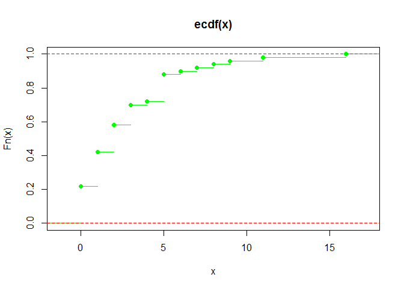
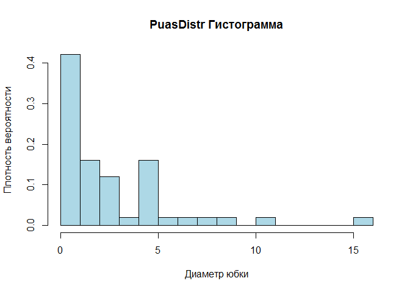

# IDZ 1
Nikita Fiodorov  
21.04.17  


Распределение в файле: [file]()

### Выполнение работы


Необходимо для каждого распределения:

**a.	**


**	вариационный ряд**

```
##  [1]  0  0  0  0  0  0  0  0  0  0  0  1  1  1  1  1  1  1  1  1  1  2  2
## [24]  2  2  2  2  2  2  3  3  3  3  3  3  4  5  5  5  5  5  5  5  5  6  7
## [47]  8  9 11 16
```
**	построить по данной выборке эмпирическую функцию распределения;**

Эмпирическая функция распределения в каждой точке принимает значение отношения числа наблюдений меньше этой точки к общему числу наблюдений.
$$\hat{F}_m(x)\;=\;\frac{1}{m}\sum_{i=1}^m I_{\left\{x_i\leq x\right\}}.$$

<h2 align="center">Эмпирические</h2>

<!-- -->

```
## $PuasDistr
## NULL
```


<p align="right"><b>Выводы:</b></p>
<p align="right">Эмпирическую функцию можно рассматривать как состоятельную оценку теоретической функции распределения </p><p align="right">т.к. по усиленному закону больших чисел $\hat{F}_m(x)$ сходится почти наверное к теоретической функции распределения $F(x):\hat{F}_m(x)\to F(x)$ почти наверное при $m \rightarrow \infty$.</p>
----

**	построить гистограмму частот;**

Пусть $X_{1},\ldots ,X_{n},\ldots$  — выборка из некоторого распределения. Определим разбиение числовой прямой ${\displaystyle -\infty <a_{0}<a_{1}<\cdots <a_{k-1}<a_{k}<\infty }$. Пусть ${\displaystyle n_{i}=\sum \limits _{j=1}^{n}\mathbf {1} _{\{X_{j}\in (a_{i-1},a_{i}]\}},\;\quad i=1,\ldots ,k}$
— число элементов выборки, попавших в ${\displaystyle i}$-й интервал. Тогда кусочно-постоянная функция ${\displaystyle {\tilde {h}}:\mathbb {R} \to \mathbb {R} }$, имеющая вид:

${\displaystyle {\tilde {h}}(x)={\frac {n_{i}}{n\Delta a_{i}}},\Delta a_{i}=a_{i}-a_{i-1},\;i=1,\ldots ,k\;}$, — называется нормализованной гистограммой.

<!-- -->

**b. Вычислить выборочные аналоги следующих числовых характеристик:**
**все характеристики**

```
##           mean var  median asm  exc
## PuasDistr 2.9  10.2 2      1.83 4.2
```

**Вероятность попадания в интервал**


```
## Empirical CDF 
## Call: ecdf(PuasDistr)
##  x[1:12] =  0,  1,  2,  ..., 1e+01, 2e+01
```
**процентили и вероятность**

```
##  [1] 0.88 0.58 0.70 1.00 0.96 0.22 0.42 0.88 0.22 0.88 0.58 0.42 0.72 0.22
## [15] 0.42 0.22 0.70 0.42 0.92 0.70 0.90 0.58 0.70 0.88 0.22 0.22 0.42 0.88
## [29] 0.88 0.22 0.22 0.42 0.58 0.22 0.88 0.98 0.22 0.88 0.22 0.58 0.94 0.58
## [43] 0.58 0.70 0.42 0.42 0.42 0.58 0.42 0.70
```

```
## [1] 0.66
```

**с) В предположении, что исходные наблюдения являются выборкой из распределения Пуассона, построить оценку максимального правдоподобия параметра λ, а также оценку λ по методу моментов. Найти смещение оценок.**


```
## [1] 2.9
```

**Метод моментов:**
Пусть случайная величина (вектор, матрица и т. д.) X имеет некоторое распределение ${\displaystyle \mathbb {P} _{\theta }}$, зависящее от параметров ${\displaystyle \theta \in \Theta \subset \mathbb {R} ^{k}}$ Пусть для функций (называемых моментами или моментными функциями) ${\displaystyle g_{i}:\mathbb {R} ^{m}\to \mathbb {R} } $, интегрируемых по мере ${\displaystyle \mathbb {P} _{\theta }}$, выполнены условия на моменты

${\displaystyle \mathbb {E} \left[g_{i}(X,\theta )\right]=0~,~~i=1..k}$
Пусть ${\displaystyle X_{1},\ldots ,X_{n}}$ — выборка случайной величины X. Предполагается, что соотношения аналогичные условиям на моменты выполнены и для выборки, а именно вместо математического ожидания в условиях на моменты необходимо использовать выборочные средние:

${\displaystyle {\overline {g_{i}(X,\theta )}}=0~,~~i=1..k}$
причем в данном представлении (когда справа от равенства — ноль) достаточно использовать просто суммы вместо средних.

Оценки, получаемые из решения этой системы уравнений (выборочных условий на моменты), называются оценками метода моментов. Название метода связано с тем, что чаще всего в качестве функций ${\displaystyle g_{i}}$ выступают функции степенного вида, математические ожидания от которых в теории вероятностей и математической статистике принято называть моментами.

Если моментные функции непрерывны, то оценки метода моментов состоятельны.


**d. Построить асимптотический доверительный интервал уровня значимости  для параметра λ на базе оценки максимального правдоподобия.**


```
## [1] 2.34 3.46
```

**Используя гистограмму частот, построить критерий значимости   проверки простой гипотезы согласия с геометрическим распределением с параметром . Проверить гипотезу на уровне значимости  . Вычислить наибольшее значение уровня значимости, на котором ещё нет основания отвергнуть данную гипотезу.**


Делим последовательность на r = 3 интервала. 

Число наблюдений, попавших в этот интервал: 

```
## [1] 36  8  6
```

Хи квадрат

```
## [1] 2.76
```
Квантили Хи квадрат (xal)

Принимаем ли гипотезу

```
## [1] FALSE
```
Наибольший уровень значимости, при котором нет оснований отвергнуть гипотезу:

```
## [1] 0.252
```

**Построить критерий значимости χ2 проверки сложной гипотезы согласия с геометрическим распределением. Проверить гипотезу на уровне значимости α1. Вычислить наибольшее значение уровня значимости, на котором еще нет оснований отвергнуть данную гипотезу.**

Сложная гипотеза согласия: $Н_0$ – основная гипотеза: $Х$ ~ $Geom (1/(\lambda+1))$ 


Граница

```
## [1] 5.41
```
Принемаем ли?

```
## [1] FALSE
```
Наибольшее значение уровня значимости, на котором еще нет оснований отвергнуть данную гипотезу.

```
## [1] 0.12
```

###dgeom

d. Построить асимптотический доверительный интервал уровня значимости для параметра λ на базе оценки максимального правдоподобия.

Оценка макс.правдоподобия

```
## [1] 2.9
```
Доверит. интервал

```
## [1] 1.79 4.01
```

Используя гистограмму частот, построить критерий значимости проверки простой гипотезы согласия с геометрическим распределением с параметром . Проверить гипотезу на уровне значимости . Вычислить наибольшее значение уровня значимости, на котором ещё нет основания отвергнуть данную гипотезу.

Хи квадрат

```
## [1] 30.5
```
Вычисление квантиля

```
## [1] 7.82
```
Принимаем ли?

```
## [1] TRUE
```
Наибольший уровень значимости, при котором нет оснований отвергнуть гипотезу

```
## [1] 2.43e-07
```
**f.**

Принимаем ли?

```
## [1] FALSE
```
Наибольший уровень значимости, при котором нет оснований отвергнуть гипотезу

```
## [1] 0.00206
```
