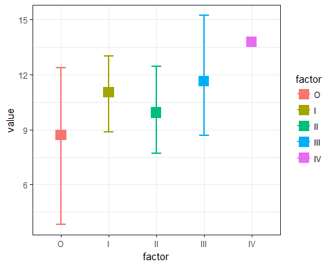
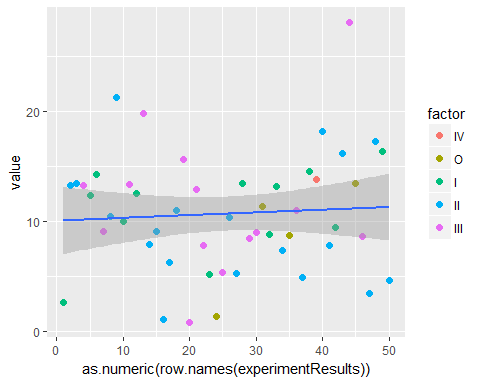
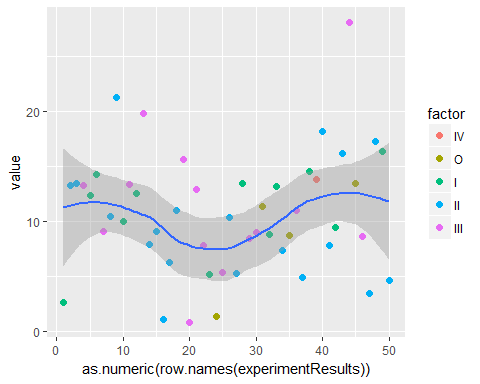

# IDZ_6
Nikita  
22.04.17  


#Однофакторный дисперсионный анализ


Датасет подготовленный для работы.

```
## 'data.frame':	50 obs. of  2 variables:
##  $ factor: Ord.factor w/ 5 levels "O"<"I"<"II"<"III"<..: 2 3 3 4 2 2 4 3 3 2 ...
##  $ value : num  2.56 13.28 13.46 13.22 12.29 ...
```

<!-- -->

Начальные предположения.

- Выборки случайно и взаимно независимы
- Ген.сов имеет нормальный закон распределения
- Ген. сов имеют равные дисперсии

Проверим что выборки распределены одинакого тестом Крускала.

```
## 
## 	Kruskal-Wallis rank sum test
## 
## data:  value by factor
## Kruskal-Wallis chi-squared = 2, df = 4, p-value = 0.7
```
Значение р оказывается совсем не близким к нулю. Поэтому мы не можем отвергнуть нулевую гипотезу о одинаковом распределении.

Посмотрим boxplot

<!-- -->

- медиана I фактора и IV выше всех
- IV фактор представлен 1 наблюдением
- самый большой разброс у II фактора
- наиб различие между IV и II гр.
- явных различий между факторами не наблюдается

Средние + errorbar
<!-- -->

Так же имеющиеся данные можно представить в виде одномерной диаграммы рассеяния:
<!-- -->


Модель 

$y_{ij} = \mu + \alpha_{i} + \epsilon_{ij}$

$y_{i,j} = \mu_i+(влияние Фактора_j на Параметр_i)+(ошибка)$

Выдвигается гипотиза о равенстве мат. ож. В случае их равенства, общее среднее явл оценкой для исследуемого параметра.

Применяется aov().


```
##             Df Sum Sq Mean Sq F value Pr(>F)
## factor       4     50    12.6    0.41    0.8
## Residuals   45   1371    30.5
```

Информация в классической таблице дисперсионного анализа:

- factor Mean Sq - оценка дисп при нулевой гип.
- Residuals Mean Sq - точечная оценка дисп независимо от выполн гип
- Pr(>F) велико -> фактор не является значимым предиктором для значения

Попарное сравнение с поправкой тьюке по умолчанию 95% д.и., но у нас a = 0.02


```
##   Tukey multiple comparisons of means
##     98% family-wise confidence level
## 
## Fit: aov(formula = value ~ factor, data = experimentResults)
## 
## $factor
##          diff    lwr   upr p adj
## I-O     2.343  -7.87 12.55 0.947
## II-O    1.228  -8.50 10.96 0.994
## III-O   2.934  -7.09 12.96 0.881
## IV-O    5.095 -14.68 24.87 0.921
## II-I   -1.115  -7.64  5.41 0.982
## III-I   0.592  -6.37  7.55 0.999
## IV-I    2.753 -15.65 21.16 0.989
## III-II  1.707  -4.52  7.94 0.904
## IV-II   3.867 -14.28 22.01 0.959
## IV-III  2.161 -16.14 20.47 0.995
```

- diff - различия в абс числах 
- lwr,upr - д.и
- p adj - статистическая значимость между группами

<!-- --><!-- --><!-- -->

- различия между группами не значимы


Функция aov() которую мы применили предназначена для анализа сбалансированных наборов данных, т.е. таких ситуаций, когда имеется одинаковое число наблюдений для каждого уровня изучаемого фактора. Если условие сбалансированности не выполняется, следует использовать функцию lm().

В нашем случае стоит это проверить.

```
## 
##   O   I  II III  IV 
##   4  12  19  14   1
```
Как мы мидим, верить aov в нашем случае нельзя. Применим lm().

###Упорядоченный фактор (polynomial contrasts: полиномиальные контрасты).

```
##          .L     .Q        .C     ^4
## [1,] -0.632  0.535 -3.16e-01  0.120
## [2,] -0.316 -0.267  6.32e-01 -0.478
## [3,]  0.000 -0.535 -4.10e-16  0.717
## [4,]  0.316 -0.267 -6.32e-01 -0.478
## [5,]  0.632  0.535  3.16e-01  0.120
```

```
## 
## Call:
## lm(formula = value ~ factor, data = experimentResults)
## 
## Residuals:
##     Min      1Q  Median      3Q     Max 
## -10.879  -3.147  -0.007   3.066  16.461 
## 
## Coefficients:
##             Estimate Std. Error t value Pr(>|t|)    
## (Intercept)   11.015      1.333    8.27  1.4e-10 ***
## factor.L       3.410      3.963    0.86     0.39    
## factor.Q       0.657      3.417    0.19     0.85    
## factor.C       1.237      2.386    0.52     0.61    
## factor^4      -1.033      1.564   -0.66     0.51    
## ---
## Signif. codes:  
## 0 '***' 0.001 '**' 0.01 '*' 0.05 '.' 0.1 ' ' 1
## 
## Residual standard error: 5.52 on 45 degrees of freedom
## Multiple R-squared:  0.0355,	Adjusted R-squared:  -0.0503 
## F-statistic: 0.414 on 4 and 45 DF,  p-value: 0.798
```

В таблице с результатами анализа мы видим:

- Residual standard error - оценка стандартного отклонения остатков. Предполагается, что остатки имеют нормальное распределение со средним значением 0 и стандартным отклонением σ. В данной строке результатов анализа как раз и приводится оценка значения σ.
- Multiple R-squared и Adjusted R-squared: коэффициент детерминации и коэффициент детерминации с поправкой на число параметров модели соответственно.
- F-statistic: значение критерия Фишера, при помощи которого проверяется нулевая гипотеза о том, что все коэффициенты модели (в нашем случае β1 и  β2) равны 0.

Во второй строке приведена информация, отражающая, насколько значения фактора I лучше по сравнению с фактором O: видим, что среднее количество в группе I было несколько выше, чем в группе O (на  3.410), но это повышение не было статистически значимым (Pr(>|t|) = 0.39).

###Не упорядоченный фактор (treatment contrasts: контрасты комбинаций условий).

Гипотезы параметров модели.

1) Cреднее значение для базового уровня $H_0: \mu_1 = 0$
2) Cреднее значение второго уровня за вычетом среднего значения базового уровня $H_0: \mu_2 - \mu_1 = 0$
3) Среднее значение третьего уровня за вычетом среднего значения базового уровня $H_0: \mu_3 - \mu_1 = 0$


```
##     I II III IV
## O   0  0   0  0
## I   1  0   0  0
## II  0  1   0  0
## III 0  0   1  0
## IV  0  0   0  1
```

```
## 
## Call:
## lm(formula = value ~ factor, data = experimentResults)
## 
## Residuals:
##     Min      1Q  Median      3Q     Max 
## -10.879  -3.147  -0.007   3.066  16.461 
## 
## Coefficients:
##             Estimate Std. Error t value Pr(>|t|)   
## (Intercept)     8.69       2.76    3.15   0.0029 **
## factorI         2.34       3.19    0.74   0.4661   
## factorII        1.23       3.04    0.40   0.6879   
## factorIII       2.93       3.13    0.94   0.3534   
## factorIV        5.09       6.17    0.83   0.4133   
## ---
## Signif. codes:  
## 0 '***' 0.001 '**' 0.01 '*' 0.05 '.' 0.1 ' ' 1
## 
## Residual standard error: 5.52 on 45 degrees of freedom
## Multiple R-squared:  0.0355,	Adjusted R-squared:  -0.0503 
## F-statistic: 0.414 on 4 and 45 DF,  p-value: 0.798
```


<table style="text-align:center"><tr><td colspan="2" style="border-bottom: 1px solid black"></td></tr><tr><td style="text-align:left"></td><td><em>Dependent variable:</em></td></tr>
<tr><td></td><td colspan="1" style="border-bottom: 1px solid black"></td></tr>
<tr><td style="text-align:left"></td><td>value</td></tr>
<tr><td colspan="2" style="border-bottom: 1px solid black"></td></tr><tr><td style="text-align:left">factorI</td><td>2.340</td></tr>
<tr><td style="text-align:left"></td><td>(3.190)</td></tr>
<tr><td style="text-align:left"></td><td></td></tr>
<tr><td style="text-align:left">factorII</td><td>1.230</td></tr>
<tr><td style="text-align:left"></td><td>(3.040)</td></tr>
<tr><td style="text-align:left"></td><td></td></tr>
<tr><td style="text-align:left">factorIII</td><td>2.930</td></tr>
<tr><td style="text-align:left"></td><td>(3.130)</td></tr>
<tr><td style="text-align:left"></td><td></td></tr>
<tr><td style="text-align:left">factorIV</td><td>5.090</td></tr>
<tr><td style="text-align:left"></td><td>(6.170)</td></tr>
<tr><td style="text-align:left"></td><td></td></tr>
<tr><td style="text-align:left">Constant</td><td>8.700<sup>***</sup></td></tr>
<tr><td style="text-align:left"></td><td>(2.760)</td></tr>
<tr><td style="text-align:left"></td><td></td></tr>
<tr><td colspan="2" style="border-bottom: 1px solid black"></td></tr><tr><td style="text-align:left">Observations</td><td>50</td></tr>
<tr><td style="text-align:left">R<sup>2</sup></td><td>0.035</td></tr>
<tr><td style="text-align:left">Adjusted R<sup>2</sup></td><td>-0.050</td></tr>
<tr><td style="text-align:left">Residual Std. Error</td><td>5.520 (df = 45)</td></tr>
<tr><td style="text-align:left">F Statistic</td><td>0.414 (df = 4; 45)</td></tr>
<tr><td colspan="2" style="border-bottom: 1px solid black"></td></tr><tr><td style="text-align:left"><em>Note:</em></td><td style="text-align:right"><sup>*</sup>p<0.1; <sup>**</sup>p<0.05; <sup>***</sup>p<0.01</td></tr>
</table>
Как видим, программа автоматически выбрала в качестве базового уровня группу наблюдений для 0

###sum contrasts: контрасты сумм

При параметризации модели дисперсионного анализа с помощью контрастов сумм базовый уровень, с которым сравниваются остальные уровни, представляет собой среднее значение из средних по каждой группе.

- Estimate - среднее в группе(коэф b в лин модели)

1) Среднее значение из средних по каждой группе ("общее среднее"): $H_0: \sum{\bar{x}_i} / k = 0$
2) Cреднее значение первого уровня за вычетом общего среднего: $H_0: \bar{x}_1 - \sum{\bar{x}_i} / k = 0$


```
##   [,1] [,2] [,3] [,4]
## 1    1    0    0    0
## 2    0    1    0    0
## 3    0    0    1    0
## 4    0    0    0    1
## 5   -1   -1   -1   -1
```

```
## 
## Call:
## lm(formula = value ~ factor, data = experimentResults)
## 
## Residuals:
##     Min      1Q  Median      3Q     Max 
## -10.879  -3.147  -0.007   3.066  16.461 
## 
## Coefficients:
##             Estimate Std. Error t value Pr(>|t|)    
## (Intercept)  11.0149     1.3326    8.27  1.4e-10 ***
## factor1      -2.3199     2.5189   -0.92     0.36    
## factor2       0.0226     1.8163    0.01     0.99    
## factor3      -1.0923     1.6546   -0.66     0.51    
## factor4       0.6144     1.7553    0.35     0.73    
## ---
## Signif. codes:  
## 0 '***' 0.001 '**' 0.01 '*' 0.05 '.' 0.1 ' ' 1
## 
## Residual standard error: 5.52 on 45 degrees of freedom
## Multiple R-squared:  0.0355,	Adjusted R-squared:  -0.0503 
## F-statistic: 0.414 on 4 and 45 DF,  p-value: 0.798
```
###Helmert contrasts: контрасты Хелмерта

1) Среднее значение из средних по каждой группе ("общее среднее"): $H_0: \sum{\bar{x}_i} / k = 0$
2) $H_0: \bar{x}_2 - (\bar{x}_1 + \sum{\bar{x}_i} / k) = 0$
3) $H_0: \bar{x}_3 - (\bar{x}_1 +  \bar{x}_2 + \sum{\bar{x}_i} / k) = 0$


```
##   [,1] [,2] [,3] [,4]
## 1   -1   -1   -1   -1
## 2    1   -1   -1   -1
## 3    0    2   -1   -1
## 4    0    0    3   -1
## 5    0    0    0    4
```

```
## 
## Call:
## lm(formula = value ~ factor, data = experimentResults)
## 
## Residuals:
##     Min      1Q  Median      3Q     Max 
## -10.879  -3.147  -0.007   3.066  16.461 
## 
## Coefficients:
##             Estimate Std. Error t value Pr(>|t|)    
## (Intercept)  11.0149     1.3326    8.27  1.4e-10 ***
## factor1       1.1713     1.5932    0.74     0.47    
## factor2       0.0188     0.6784    0.03     0.98    
## factor3       0.4361     0.4665    0.93     0.35    
## factor4       0.6938     1.1195    0.62     0.54    
## ---
## Signif. codes:  
## 0 '***' 0.001 '**' 0.01 '*' 0.05 '.' 0.1 ' ' 1
## 
## Residual standard error: 5.52 on 45 degrees of freedom
## Multiple R-squared:  0.0355,	Adjusted R-squared:  -0.0503 
## F-statistic: 0.414 on 4 and 45 DF,  p-value: 0.798
```
###Изменим базовый уровень на 4 (обычный контраст комбинаций)

```
## [1] "IV"  "O"   "I"   "II"  "III"
```

```
## 
## Call:
## lm(formula = value ~ factor, data = experimentResults)
## 
## Residuals:
##     Min      1Q  Median      3Q     Max 
## -10.879  -3.147  -0.008   3.066  16.461 
## 
## Coefficients:
##             Estimate Std. Error t value Pr(>|t|)  
## (Intercept)    13.79       5.52    2.50    0.016 *
## factorO        -5.10       6.17   -0.83    0.413  
## factorI        -2.75       5.74   -0.48    0.634  
## factorII       -3.87       5.66   -0.68    0.498  
## factorIII      -2.16       5.71   -0.38    0.707  
## ---
## Signif. codes:  
## 0 '***' 0.001 '**' 0.01 '*' 0.05 '.' 0.1 ' ' 1
## 
## Residual standard error: 5.52 on 45 degrees of freedom
## Multiple R-squared:  0.0355,	Adjusted R-squared:  -0.0503 
## F-statistic: 0.414 on 4 and 45 DF,  p-value: 0.798
```

<!-- -->


<!-- --><!-- --><!-- --><!-- -->


Сноска про тест Тьюки

Tukey's test compares the means of every treatment to the means of every other treatment; that is, it applies simultaneously to the set of all pairwise comparisons ${\displaystyle \mu _{i}-\mu _{j}\,}$, 
and identifies any difference between two means that is greater than the expected standard error. The confidence coefficient for the set, when all sample sizes are equal, is exactly $1 − \alpha$. For unequal sample sizes, the confidence coefficient is greater than $1 − \alpha$. In other words, the Tukey method is conservative when there are unequal sample sizes.

The Tukey confidence limits for all pairwise comparisons with confidence coefficient of at least $1 − \alpha$ are

${\displaystyle {\bar {y}}_{i\bullet }-{\bar {y}}_{j\bullet }\pm {\frac {q_{\alpha ;k;N-k}}{\sqrt {2}}}{\widehat {\sigma }}_{\varepsilon }{\sqrt {\frac {2}{n}}}\qquad i,j=1,\ldots ,k\quad i\neq j.}$.
