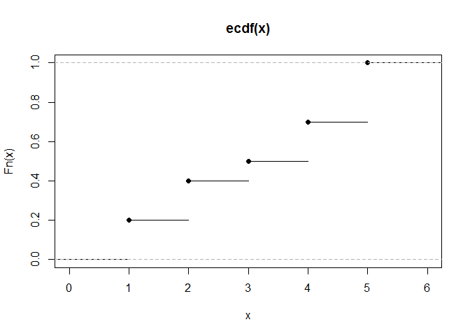
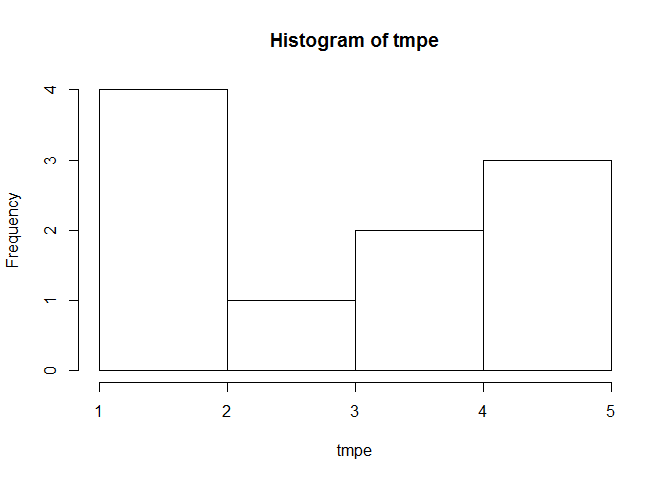

# IDZ_6
Nikita  
22.04.17  


##Эмпирическая функция распределения или выборочная ф.р.

```
##  [1] 1 1 2 2 3 4 4 5 5 5
```

<!-- -->

1) Расстояние между линиями по оси $F_n(x)$ - то сколько встретился $x$

2) Ось $F_n(x)$ показывает процент того, сколько $x_i<x$ от общего числа в выборке.

##Гистограмма - график приближающий плотность

```
##  [1] 1 1 2 2 3 4 4 5 5 5
```

<!-- -->

1) Столбик - то сколько элементов попало в промежуток разбиения.
    - $[1,2] - \{1,1,2,2\};$
    - $(2,3] - \{3\};$
    - $(3,4] - \{4,4\};$
2) Обычно на вертикальной оси $"колличество"/("длинну- интервала"*"общее-колличество")$, тогда сумма площадей 1.


 Определение 5. Статистика $\theta^* = \theta^*(X_1,...,X_n)$ называется несмещённой оценкой параметра $\theta$, если для любого θ ∈ Θ выполнено равенство $E\theta^*=\theta$. 
 
 Определение 6. Статистика θ* = θ*(X1,...,Xn) называется асимптотически несмещённой оценкой параметра θ, если для любого θ∈ Θ имеет место сходимость Eθ* →θ при n →∞. 
 
 Определение 7. Статистика θ* = θ*(X1,...,Xn) называется состоятельной оценкой параметра θ, если для любого θ∈ Θ имеет место сходимость θ* p −→θ при n →∞. 
