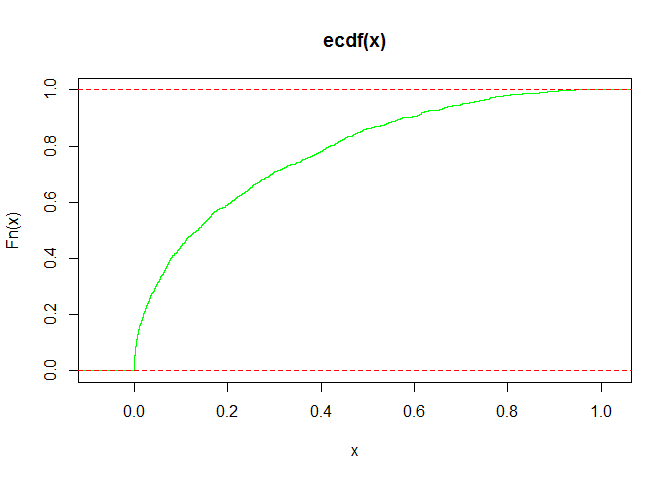
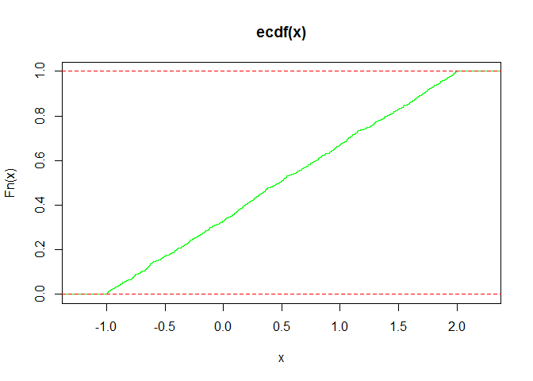
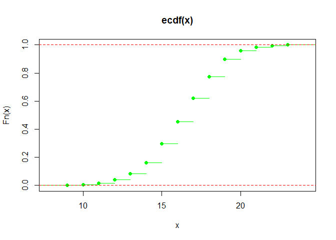
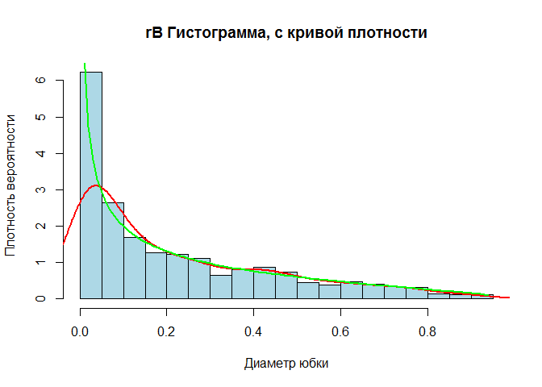
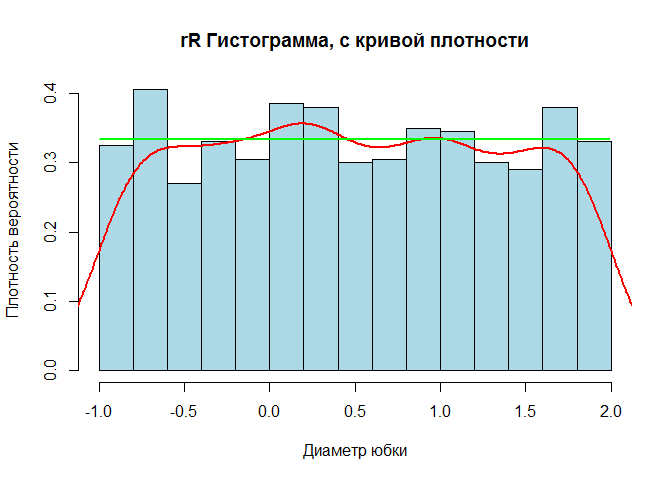
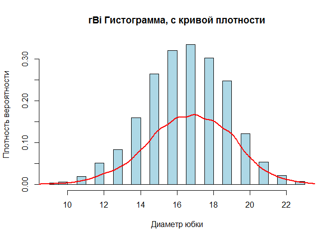
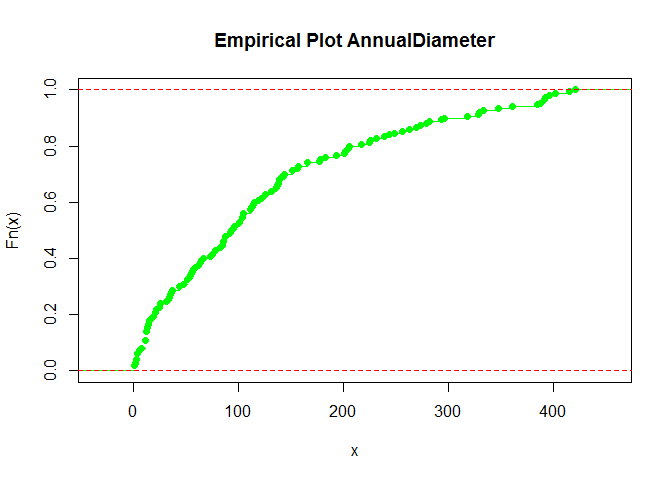
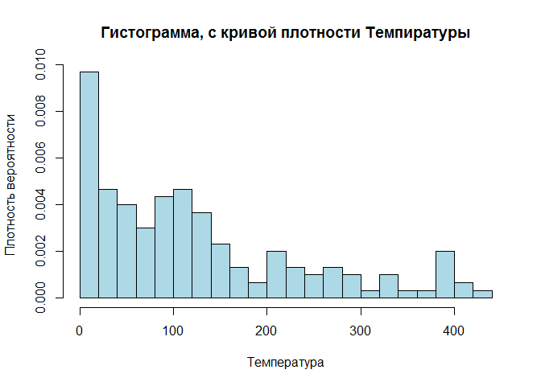

# IDZ 1
  
  


---


Даны следующие распределения и параметры:

Тип Распределения			      | Параметры
----------------------------|--------------
Бета						            | p=1/2, b=5/3
Равномерное					        | a=-1, b=2
Биномиальное 	              | m=25, p=2/3


### Выполнение работы


Необходимо для каждого распределения:

**a.	сгенерировать выборку длины 1000 из данного распределения (см. стр. 19 методички)**


```
##               rB     rR  rBi
## Min.    6.81e-08 -0.999  9.0
## 1st Qu. 3.13e-02 -0.254 15.0
## Median  1.36e-01  0.481 17.0
## Mean    2.19e-01  0.494 16.7
## 3rd Qu. 3.61e-01  1.250 18.0
## Max.    9.46e-01  2.000 23.0
```

**b.	построить по данной выборке эмпирическую функцию распределения;**

Эмпирическая функция распределения в каждой точке принимает значение отношения числа наблюдений меньше этой точки к общему числу наблюдений.
$$\hat{F}_m(x)\;=\;\frac{1}{m}\sum_{i=1}^m I_{\left\{x_i\leq x\right\}}.$$

<h2 align="center">Эмпирические</h2>

<!-- --><!-- --><!-- -->


<p align="right"><b>Выводы:</b></p>
<p align="right">Эмпирическую функцию можно рассматривать как состоятельную оценку теоретической функции распределения </p><p align="right">т.к. по усиленному закону больших чисел $\hat{F}_m(x)$ сходится почти наверное к теоретической функции распределения $F(x):\hat{F}_m(x)\to F(x)$ почти наверное при $m \rightarrow \infty$.</p>
----

**c.	построить гистограмму частот;**
**d.	сравнить гистограмму частот и реальную плотность данного распределения (вычисление значения плотности в точке в пакете R описано на той же 19 стр.)**

Пусть $X_{1},\ldots ,X_{n},\ldots$  — выборка из некоторого распределения. Определим разбиение числовой прямой ${\displaystyle -\infty <a_{0}<a_{1}<\cdots <a_{k-1}<a_{k}<\infty }$. Пусть ${\displaystyle n_{i}=\sum \limits _{j=1}^{n}\mathbf {1} _{\{X_{j}\in (a_{i-1},a_{i}]\}},\;\quad i=1,\ldots ,k}$
— число элементов выборки, попавших в ${\displaystyle i}$-й интервал. Тогда кусочно-постоянная функция ${\displaystyle {\tilde {h}}:\mathbb {R} \to \mathbb {R} }$, имеющая вид:

${\displaystyle {\tilde {h}}(x)={\frac {n_{i}}{n\Delta a_{i}}},\Delta a_{i}=a_{i}-a_{i-1},\;i=1,\ldots ,k\;}$, — называется нормализованной гистограммой.


<p color="green" align="right">**Реальное** распределение - **ЗЕЛЕНЫМ**</p>
<p color="red" align="right">**Выборочное** распределение - **КРАСНЫМ**</p>

<h2 align="center">Гистограммы</h2>

<!-- --><!-- --><!-- -->


<p align="right"><b>Выводы:</b></p>
<p align="right"><i>По гистограммам видно, что распр. выборки из 1000 наблюбений близко к ген.сов. и видно распределение плотности</i></p>
----


**e.	вычислить следующие выборочные характеристики:  выборочное среднее, выборочную дисперсию, выборочную асимметрию, выборочный эксцесс; (см. стр. 20-22 методички)**

Таблица выборочных значений:


```
##     mean  var    asm    exc    
## rB  0.219 0.0523 1.09   0.261  
## rR  0.494 0.758  0.018  -1.19  
## rBi 16.7  5.33   -0.171 -0.0112
```

**f.	сравнить результаты пункта e  с реальными характеристиками распределения** 

Таблица ожидаемых значений:


```
##        a   var   asm   exc
## rB   0.3  0.18 2.828 12.00
## rR  -1.0  4.00 0.000  0.00
## rBi 12.5 18.75 0.462  0.16
```

Таблица смежности:


```
##        mean     var    asm     exc
## rB  -0.0807  -0.128 -1.735 -11.739
## rR   1.4941  -3.242  0.018  -1.187
## rBi  4.2100 -13.417 -0.633  -0.171
```
<p align="right"><b>Выводы:</b></p>
<p align="right"><i>Значения выборки совпали с значегиями для ГС, предположительно различия не значимы</i></p></p>
----
###Распределение из файла:


**Повторяем пункты a-d**

<h2 align="center">Эмпирическое распределение</h2>
<!-- -->

<h2 align="center">Гистограмма</h2>

<!-- -->

Таблица значений параметров:


```
##   mean   var  asm  exc
## 1  124 12698 1.03 0.14
```

<p align="right"><b>Выводы:</b></p>
<p align="right"><i>Данных(150 наблюдений) недостаточно, чтобы делать выводы о распределении темпиратур, имеются выбросы, возможно это ошибочные данные и есть смысл исключить их или заменить на среднее по выборке. Эмпирическая функция похожа на распределение Вейбулла</i></p>

----
```R

# сохраняем результаты

write.csv(AnnualDiameterProp,file = "AnnualDiameterProp.csv")

write.csv(distributionsProp,file = "tProp.csv")

```


