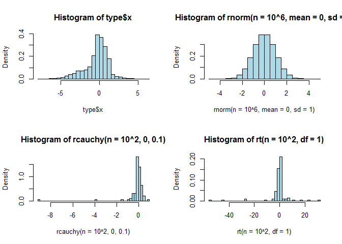
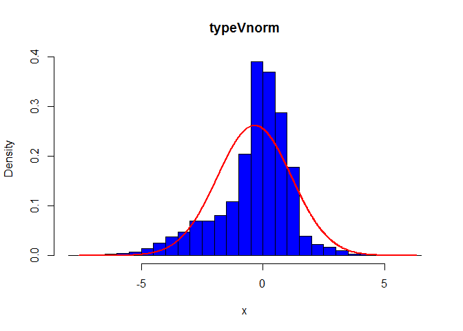

# IDZ 2
  
  


<a name="Idz_2"></a>
### Данные

Даны следующие распределения и параметры:

Тип Распределения			      | Параметры
----------------------------|--------------
Коши						            | a in R, b > 0 
Равномерное				        	| a ≤ b


```
##              unif          cauchy            type
## 1 Min.   :-4.12   Min.   : -911   Min.   :-7.58  
## 2 1st Qu.:-2.91   1st Qu.:   -1   1st Qu.:-0.90  
## 3 Median :-1.66   Median :    0   Median :-0.07  
## 4 Mean   :-1.67   Mean   :    5   Mean   :-0.34  
## 5 3rd Qu.:-0.44   3rd Qu.:    1   3rd Qu.: 0.62  
## 6 Max.   : 0.74   Max.   :11138   Max.   : 6.32
```

### Выполнение работы

#### Выборочная дисперсия, несмещенная выборочная дисперсия, эффективная выборочная дисперсия.

Пусть $X_{1},\ldots ,X_{n},\ldots$  — выборка из распределения вероятности. Тогда

- выборочная дисперсия — это случайная величина $S_{n}^{2}={\frac  {1}{n}}\sum \limits _{{i=1}}^{n}\left(X_{i}-{\bar  {X}}\right)^{2}={\frac  {1}{n}}\sum \limits _{{i=1}}^{n}X_{i}^{2}-\left({\frac  {1}{n}}\sum \limits _{{i=1}}^{n}X_{i}\right)^{2},$

- несмещённая (исправленная) дисперсия — это случайная величина $S^{2}={\frac  {1}{n-1}}\sum \limits _{{i=1}}^{n}\left(X_{i}-{\bar  {X}}\right)^{2}$ или $S^{2}={\frac  {n}{n-1}}S_{n}^{2}.$

- эффективная выборочная дисперсия $S^{x^{2}}={\frac  {n-1}{n+1}}S_{n}^{2}.$ Эта оценка будет не несмещенной;
Все три выборочные дисперсии являются состоятельными оценками теоретической дисперсии. Если ${\mathrm  {D}}[X_{i}]=\sigma ^{2}<\infty$ , то $S_{n}^{2}\to ^{{\!\!\!\!\!\!{\mathbb  {P}}}}\;\sigma ^{2}$
, $S^{2}\to ^{{\!\!\!\!\!\!{\mathbb  {P}}}}\;\sigma ^{2}$ и $S^{x^{2}}\to ^{{\!\!\!\!\!\!{\mathbb  {P}}}}\;\sigma ^{2}$.


####	Для выборок объема 10, 100, 1000, 10^{4} из стандартного нормального закона(0, 1)

$$f(x,\mu,\sigma)={\tfrac {1}{\sigma {\sqrt {2\pi }}}}\;e^{-{\frac {(x-\mu )^{2}}{2\sigma ^{2}}}},$$
$$F(x,0,1) = \frac 1 {\sqrt {2 \pi}} \int _{-\infty} ^x e^{ -\frac {t^2}{2}} dt.$$
Статистики случайной выборки выборок:


```
##         vars   var varef
## x10    0.819 0.910 1.001
## x100   0.809 0.817 0.826
## x1000  1.009 1.010 1.011
## x10000 0.997 0.998 0.998
```

#### Абсолютное значение отклонения(=1)


В для 10 средних по выборке:


```
##           vars     var   varef
## x10    0.42094 0.37661 0.34830
## x100   0.07320 0.07596 0.07872
## x1000  0.02870 0.02893 0.02927
## x10000 0.00743 0.00745 0.00747
```

<p align="right"><b>Выводы:</b></p>
<p align="right"><i>При больших n, асимптотически эффективной оценкой дисперсии 
является выборочная дисперсия. </i></p></p>
<p align="right"><i>При больших n, состоятельной оценкой дисперсии 
является исправленная(не смещенная) выборочная дисперсия.</i></p></p>

----

#### Оценка параметров, использую метод максимального правдоподобия.


#### Построение оценки для Коши

$f_{X}(x)={\frac  {1}{\pi \gamma \left[1+\left({\frac  {x-x_{0}}{\gamma }}\right)^{2}\right]}}={1 \over \pi }\left[{\gamma  \over (x-x_{0})^{2}+\gamma ^{2}}\right]$, где ${\displaystyle x_{0}\in \mathbb {R} }$ — параметр сдвига; ${\displaystyle \gamma >0}$ — параметр масштаба.

$$LL(x;x_{0},\gamma)=n*log(\gamma)+\sum n*log(\gamma^2 + (x_{i}−x_{0})^ 2 )$$

Запишем так:

$$\log{\left (\frac{y}{\pi} \frac{1}{y^{2} + \left(x - z\right)^{2}} \right )}$$

Частные производные:

$$\frac{\partial}{\partial y} f{\left (x,y,z \right )} = \frac{1}{y} \left(y^{2} + \left(x - z\right)^{2}\right) \left(- \frac{2 y^{2}}{\left(y^{2} + \left(x - z\right)^{2}\right)^{2}} + \frac{1}{y^{2} + \left(x - z\right)^{2}}\right) = 0$$
$$\frac{\partial}{\partial z} f{\left (x,y,z \right )} = \frac{2 x - 2 z}{y^{2} + \left(x - z\right)^{2}} =0$$

Эта система не решаема. По этому все вычисления предоставим mledist из библиотеки fitdistrplus. 

#### Построение оценки для равномерного распределения


#### Сравнение с Коши


```
## location    scale 
##    0.142    1.275
```

#### Сравнение с Равномерным


```
##    min    max 
## -4.117  0.744
```


#### Предположение о неизвестном распределении.

<!-- -->

<p align="right"><b>Предположение:</b></p>
<p align="right"><i>Бета или хи, т.к. тяжелые хвосты и холм</i></p></p>

#### Сравнение с Коши


```
## $estimate
## location    scale 
##  0.00445  0.68369 
## 
## $convergence
## [1] 0
## 
## $loglik
## [1] -16658
## 
## $hessian
##          location scale
## location     8541   417
## scale         417 10713
## 
## $optim.function
## [1] "optim"
## 
## $fix.arg
## NULL
## 
## $optim.method
## [1] "Nelder-Mead"
## 
## $fix.arg.fun
## NULL
## 
## $weights
## NULL
## 
## $counts
## function gradient 
##       39       NA 
## 
## $optim.message
## NULL
```
Посмотрим гистограмы:
<!-- -->
<p align="right"><i>Близко</i></p></p>


#### Сравнение с нормальным


```
## $estimate
##   mean     sd 
## -0.338  1.522 
## 
## $convergence
## [1] 0
## 
## $loglik
## [1] -16552
## 
## $hessian
##      mean   sd
## mean 3884    0
## sd      0 7767
## 
## $optim.function
## [1] "optim"
## 
## $fix.arg
## NULL
## 
## $optim.method
## [1] "Nelder-Mead"
## 
## $fix.arg.fun
## NULL
## 
## $weights
## NULL
## 
## $counts
## function gradient 
##       41       NA 
## 
## $optim.message
## NULL
```

Посмотрим гистограмы:
<!-- -->
Совсем нет.
